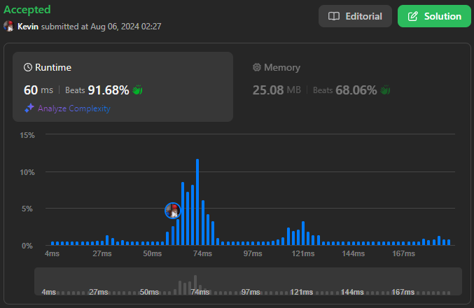

# 3016. Minimum Number of Pushes to Type Word II

## Énoncé

On vous donne une chaîne de caractères `word` contenant des lettres minuscules de l'alphabet anglais.

Les claviers téléphoniques ont des touches associées à des collections **distinctes** de lettres minuscules, qui peuvent être utilisées pour former des mots en appuyant dessus. Par exemple, la touche `2` est associée à `["a","b","c"]`, il faut appuyer une fois sur la touche pour ecrire `"a"`, deux fois pour ecrire `"b"`, et trois fois pour ecrire `"c"`.

Il est possible de réassigner les touches numérotées de `2` à `9` à des collections **distinctes** de lettres. Les touches peuvent être réassignées à **n'importe quel** nombre de lettres, mais chaque lettre **doit** être assignée à **exactement** une touche. Vous devez trouver le **nombre minimum** de fois où les touches doivent être appuyées pour taper la chaîne `word`.

Retournez le **nombre minimum** d'appuis nécessaires pour taper `word` après avoir réassigné les touches.

Un exemple de correspondance des lettres aux touches sur un clavier téléphonique est donné ci-dessous. Notez que `1`, `*`, `#` et `0` ne sont associés à aucune lettre.


## Exemple

**Exemple 1:**  
**Input:** word = "abcde"  
**Output:** 5

**Exemple 2:**  
**Input:** word = "aabbccddeeffgghhiiiiii"  
**Output:** 24

## Contraintes

`1 <= word.length <= 10^5`  
`word` se compose de lettres anglaises minuscules.

## Note personnelle

Pour résoudre ce problème, j'ai choisi d'adopter une approche gloutonne (greedy). L'idée est assez intuitive: il s'agit de trier les caractères du mot en fonction de leur fréquence d'apparition. Ensuite, on assigne les caractères ayant les fréquences les plus élevées aux positions nécessitant le moins de pressions.

Étant donné que l'objectif du programme est de calculer le nombre total de pressions, il n'est pas nécessaire de conserver une trace des caractères associés à chaque fréquence. Pour obtenir le nombre de pressions, il suffit de parcourir le tableau des fréquences triées et de multiplier chaque fréquence par le nombre de pressions requises pour la position correspondante, en utilisant la formule suivante `count[i] * ( (i / 8) + 1 )`.

```cpp
int minimumPushes(string word) {
  vector<int> count(26, 0); // Tableau pour compter les occurrences de chaque lettre

  // Compter les occurrences de chaque lettre dans le mot
  for(char c : word){
    count[c - 'a']++;
  }

  // Trier les comptes par ordre décroissant
  sort(count.begin(), count.end(), greater<int>());

  // Variable pour stocker le résultat final
  int ans = 0;

  // Calculer le nombre de pressions nécessaires
  for(int i = 0; i < 26 && count[i] > 0; i++){
    // Les 8 premières lettres nécessitent 1 pression, les 8 suivantes 2 pressions, etc.
    ans += count[i] * ( (i / 8) + 1 );
  }

  return ans;
}
```

- Complexité Temporelle: `O(n)`.
- Complexité Spatiale: `O(1)`.



