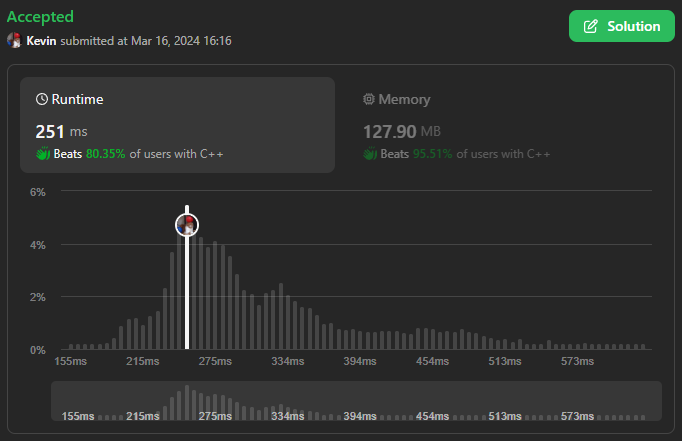
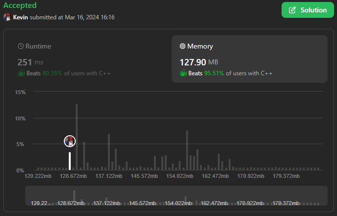

# 3080. Mark Elements on Array by Performing Queries

## Énoncé

Vous recevez un tableau `nums` **indexé à 0** de taille `n` composé d'entiers positifs.

Vous recevez également un tableau 2D `queries` de taille `m` où `queries[i] = [indexi, ki]`.

Initialement, tous les éléments du tableau ne sont **pas marqués**.

Vous devez appliquer `m` requêtes sur le tableau dans l'ordre, où lors de la `ième` requête, vous faites ce qui suit :

- Marquez l'élément à l'index `indexi` s'il n'est pas déjà marqué.
- Ensuite, marquer `ki` éléments non marqués dans le tableau ayant les **plus petites** valeurs.

Si plusieurs éléments de ce type existent, marquer ceux avec les plus petits indices. Et s'il existe moins de `ki` éléments non marqués, alors marquez-les tous.

Retourner un tableau answer de taille `m` où `answer[i]` est la **somme** des éléments non marqués dans le tableau après la `ième` requête.

## Exemple

**Exemple 1:**  
**Input:** nums = [1,2,2,1,2,3,1], queries = [[1,2],[3,3],[4,2]]  
**Output:** [8,3,0]  
**Explication:**  
Nous effectuons les requêtes suivantes sur le tableau:

- Marquez l'élément à l'index `1`, et `2` des plus petits éléments non marqués avec les plus petits indices s'ils existent, les éléments marqués sont maintenant **nums = [<ins>1</ins>,<ins>2</ins>,2,<ins>1</ins>,2,3,1]**. La somme des éléments non marqués est `2 + 2 + 3 + 1 = 8`.
- Marquez l'élément à l'index `3`, puisqu'il est déjà marqué, nous l'ignorons. Ensuite, nous marquons `3` des plus petits éléments non marqués avec les plus petits indices, les éléments marqués sont maintenant **nums = [<ins>1</ins>,<ins>2</ins>,<ins>2</ins>,<ins>1</ins>,<ins>2</ins>,3,<ins>1</ins>]**. La somme des éléments non marqués est `3`.
- Marquez l'élément à l'index `4`,puisqu'il est déjà marqué, nous l'ignorons. Ensuite, nous marquons `2` des plus petits éléments non marqués avec les plus petits indices s'ils existent, les éléments marqués sont maintenant **nums = [<ins>1</ins>,<ins>2</ins>,<ins>2</ins>,<ins>1</ins>,<ins>2</ins>,<ins>3</ins>,<ins>1</ins>]**. La somme des éléments non marqués est `0`.

**Exemple 2:**  
**Input:** nums = [1,4,2,3], queries = [[0,1]]  
**Output:** [7]  
**Explication:**  
Nous effectuons une requête qui consiste à marquer l'élément à l'index `0` et à marquer le plus petit élément parmi les éléments non marqués. Les éléments marqués seront **nums = [<ins>1</ins>,4,<ins>2</ins>,3]**, et la somme des éléments non marqués est `4 + 3 = 7`.

## Contraintes

`n == nums.length`  
`m == queries.length`  
`1 <= m <= n <= 10^5`  
`1 <= nums[i] <= 10^5`  
`queries[i].length == 2`  
`0 <= indexi, ki <= n - 1`

## Note personnelle

Ma méthode utilise une file de priorité afin d'obtenir en temps constant l'élément le plus petit avec l'indice le plus bas.

J'ai défini une structure comprenant deux propriétés, `index` et `value`, ainsi qu'une fonction de comparaison utilisée pour la file de priorité.

La première étape de mon algorithme consiste à calculer la somme totale de `nums` pour éviter de recalculer la somme des éléments non marqués. J'en profite également pour placer les éléments dans la file de priorité.

Je crée un tableau booléen de taille `nums.size` avec chaque valeur initialisée à `false` pour marquer les éléments, ainsi qu'un tableau de taille `queries.size` pour stocker les valeurs de retour.

Ensuite, je parcours les `queries`. À chaque itération, je vérifie si `indexi` est marqué. Si ce n'est pas le cas, je le marque et soustrais sa valeur de ma somme totale.

Ensuite, je parcours les éléments de ma file de priorité pour récupérer les `ki` plus petits éléments non marqués et soustrais leurs valeurs de ma somme.

Je rajoute la somme restante à mon tableau de réponses.

La complexité temporelle est de `O((n + m) * log(n))` en raison des opérations sur la file de priorité, où `n` est la taille de `nums` et `m` la taille de `queries`. La complexité spatiale est de `O(n)` ou `O(m)` en fonction de si `n` ou `m` est le plus grand.

