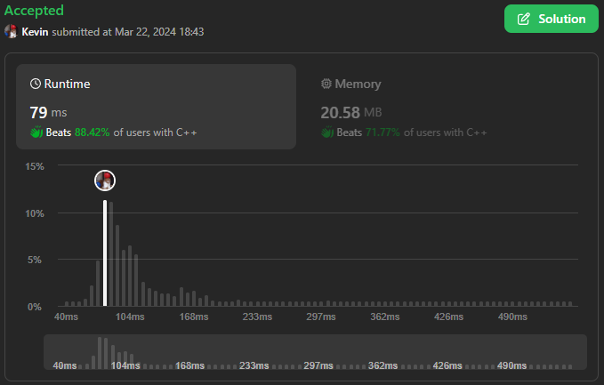

# 3081. Replace Question Marks in String to Minimize Its Value

## Énoncé

Vous recevez une chaîne `s`. `s[i]` est soit une lettre anglaise minuscule, soit `'?'`.

Pour une chaîne `t` ayant une longueur `m` contenant **uniquement** des lettres anglaises minuscules, nous définissons la fonction `cost(i)` pour un index `i` comme le nombre de caractères égal à `t[i]` qui est apparu avant lui, c'est-à-dire dans la plage `[0, i - 1]`.

La **valeur** de `t` est la **somme** de `cost(i)` pour tous les indices `i`.

Par exemple, pour la chaîne `t = "aab"`:

- `cost(0) = 0`
- `cost(1) = 1`
- `cost(2) = 0`
- Par conséquent, la valeur de `"aab"` est `0 + 1 + 0 = 1`.

Votre tâche consiste à **remplacer toutes** les occurrences de `'?'` dans `s` par n'importe quelle lettre anglaise minuscule afin que la **valeur** de `s` soit **minimisée**.

Renvoie une chaîne désignant la chaîne modifiée avec les occurrences remplacées de `'?'`. S'il existe plusieurs chaînes résultant de la **valeur minimale**, renvoie la plus petite lexicographiquement.

## Exemple

**Exemple 1:**  
**Input:** s = "???"  
**Output:** "abc"  
**Explication:** Dans cet exemple, nous pouvons remplacer les occurrences de `'?'` pour rendre `s` égale à `"abc"`.  
Pour `"abc"`, `cost(0) = 0`, `cost(1) = 0`, et `cost(2) = 0`.  
La valeur de `"abc"` est `0`.  
Certaines autres modifications de `s` qui ont une valeur de `0` sont `"cba"`, `"abz"` et `"hey"`.
Parmi tous, nous choisissons le plus petit lexicographiquement.

**Exemple 2:**  
**Input:** s = "a?a?"  
**Output:** "abac"  
**Explication:** Dans cet exemple, les occurrences de `'?'` peuvent être remplacé pour rendre `s` égale à `"abac"`.  
Pour `"abac"`, `cost(0) = 0`, `cost(1) = 0`, `cost(2) = 1`, et `cost(3) = 0`.  
La valeur de `"abac"` est `1`.

## Contraintes

`1 <= s.length <= 10^5`  
`s[i]` est soit une lettre anglaise minuscule, soit `'?'`.

## Note personnelle

Lors du concours **"Biweekly Contest 126"**, j'ai rencontré un exercice qui a posé quelques défis. Dans le feu de l'action, j'ai d'abord mis au point une solution peu optimisée qui a fini par **Time Out** en raison de contraintes de temps strictes. Cependant, à seulement quatre minutes de la fin, j'ai eu une révélation sur la manière d'optimiser ma solution. Malheureusement, je n'ai pas eu le temps de l'implémenter.

Après la fin du concours, j'ai pris le temps d'examiner si ma solution était correcte une fois que l'exercice avait été publié sur la plateforme. Ma première idée a été de simplifier la formule du `cost`. Après avoir analysé les paramètres pris en compte dans ce calcul, j'ai réalisé que minimiser le `cost` équivaut à minimiser le nombre d'occurrences d'un même caractère.

Avec ce problème simplifié en tête, j'ai entrepris de mettre en œuvre ma solution. L'algorithme commence par compter le nombre d'occurrences de chaque élément dans la chaîne `s` et les stocke dans un vecteur de taille 26 appelé `frequency` Le nombre d'occurrences de `'?'` est également pris en compte et stocké dans une variable distincte, `nbQuestionMark`.

Ensuite, j'ai initialisé une file de priorité avec une structure personnalisée qui contient un caractère et son nombre d'occurrences actuel. Un foncteur personnalisé a également été déclaré pour permettre le tri de cette structure, en privilégiant d'abord le nombre d'occurrences, puis le caractère dans l'ordre alphabétique.

La file de priorité a ensuite été remplie avec les occurrences comptées dans `frequency`. Un vecteur de caractères temporaire, `temp` , a été initialisé pour stocker les caractères qui seront utilisés pour remplacer les `'?'` dans `s`.

L'algorithme itère ensuite sur le nombre de `'?'` présents dans la chaîne et récupère le caractère en haut de la file de priorité. Ce caractère est alors stocké dans `temp` et réinséré dans la file de priorité avec son nombre d'occurrences incrémenté.

Le vecteur `temp` est trié par ordre alphabétique. Enfin, `s` est parcouru une dernière fois et les `'?'` sont remplacés par les caractères correspondants dans `temp`.

```cpp
// Structure définissant un caractère et son nombre d'occurrences
struct pkv {
  char c;
  int count;
};

// Foncteur pour comparer les structures pkv
struct comparePKV {
  // Trie d'abord par le nombre d'occurrences, puis par ordre alphabétique
  bool operator()(pkv const& a, pkv const& b) {
    if (a.count == b.count) {
      return a.c > b.c;
    }
    return a.count > b.count;
  }
};

class Solution {
public:
  string minimizeStringValue(string s) {
    // Vecteur pour compter les occurrences de chaque caractère
    vector<int> frequency(26, 0);
    // Compteur pour le nombre de '?' dans la chaîne
    int nbQuestionMarks = 0;

    // Compter les occurrences de chaque caractère et le nombre de '?'
    for (int i = 0; i < s.size(); i++) {
      char c = s[i];
      if (c != '?') {
        // Incrémenter le compteur d'occurrences du caractère
        frequency[c - 'a']++;
      }
      else {
        // Incrémenter le compteur de '?'
        nbQuestionMarks++;
      }
    }

    // Créer une file de priorité pour stocker les structures pkv
    priority_queue<pkv, vector<pkv>, comparePKV> pq;

    // Remplir la file de priorité avec les caractères et leur nombre d'occurrences
    for (int i = 0; i < frequency.size(); i++) {
      char c = 'a' + i;
      pq.push({c, frequency[i]});
    }

    // Créer un vecteur temporaire pour stocker les caractères à insérer
    vector<char> temp;

    // Insérer les caractères '?' dans le vecteur temporaire en fonction de leur occurrence
    for (int i = 0; i < nbQuestionMarks; i++) {
      // Récupérer le caractère avec le plus petit nombre d'occurrences
      pkv current = pq.top();
      // Retirer le caractère de la file de priorité
      pq.pop();

      // Stocker le caractère avec le moins d'occurrences
      temp.push_back(current.c);
      // Réinsérer le caractère avec un nombre d'occurrences incrémenté
      pq.push({current.c, current.count + 1});
    }

    // Trier le vecteur temporaire par ordre alphabétique
    sort(temp.begin(), temp.end());

    // Indice pour parcourir le vecteur temporaire
    int j = 0;
    // Remplacer les '?' dans la chaîne par les caractères appropriés en utilisant le vecteur temporaire
    for (int i = 0; i < s.size(); i++) {
      char c = s[i];
      if (c == '?') {
        // Remplacer le '?' par le caractère approprié du vecteur temporaire
        s[i] = temp[j];
        j++;
      }
    }

    // Retourner la chaîne modifiée
    return s;
  }
};
```

La complexité temporelle de cet algorithme est de `O(n log n)`, principalement due au tri du vecteur `temp`, tandis que la complexité spatiale est de `O(n)`.

Une amélioration potentielle consisterait à remplacer le vecteur `temp` en réutilisant le vecteur `frequency`. Après avoir rempli la file de priorité, le vecteur `frequency` serait réinitialisé à zéro. Ensuite, les caractères à utiliser pour remplacer les `'?'` seraient déterminés en incrémentant simplement les occurrences dans `frequency`. Enfin, `s` serait parcouru à nouveau, et les `'?'` seraient remplacés par les caractères appropriés en utilisant les occurrences stockées dans `frequency`.

```cpp
// Réinitialiser le vecteur de fréquence
for(int i = 0; i < frequency.size(); i++){
  frequency[i] = 0;
}
// Trouver les caractères à utiliser pour remplacer les '?'
for (int i = 0; i < nbQuestionMarks; i++) {
  // Récupérer le caractère avec le plus petit nombre d'occurrences
  pkv current = pq.top();
  // Retirer le caractère de la file de priorité
  pq.pop();

  // Incrémenter le compteur d'occurrences pour le caractère
  frequency[current.c - 'a']++;

  // Réinsérer le caractère avec un nombre d'occurrences incrémenté
  pq.push({current.c, current.count + 1});
}
```

```cpp
// Indice pour parcourir le vecteur de fréquence
int j = 0;

// Remplacer les '?' dans la chaîne par les caractères appropriés en utilisant le vecteur de fréquence
for (int i = 0; i < s.size(); i++) {
  if (s[i] == '?') {
    // Trouver le prochain caractère disponible
    while (frequency[j] == 0) { j++; }
    // Remplacer le '?' par le caractère approprié
    s[i] = 'a' + j;
    // Décrémenter le compteur d'occurrences pour le caractère utilisé
    frequency[j]--;
  }
}
```

Cette méthode permettrait d'éliminer le besoin de tri et de réduire la complexité temporelle à `O(n)`, avec une complexité spatiale constante amortie à `O(1)`, étant donné que aucune des structures de données utilisées n'a un nombre d'éléments proportionnel à la longueur de l'entrée.



