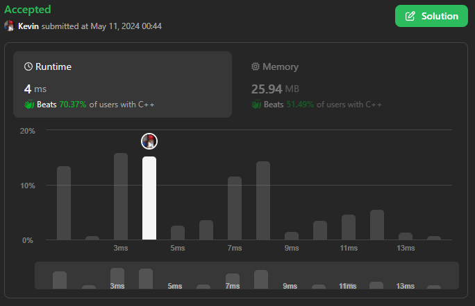
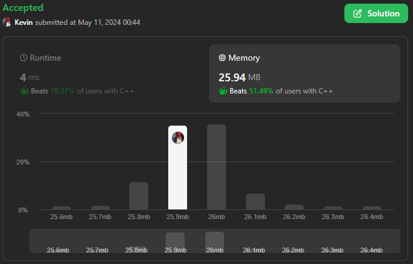

# 3095. Shortest Subarray With OR at Least K I

## Énoncé

On vous donne un tableau `nums` d'entiers **non négatifs** et un entier `k`.

Un tableau est appelé **spécial** si le `OR` bit à bit de tous ses éléments est **au moins** `k`.

Retournez la longueur du **plus court sous-tableau spécial non vide** de `nums`, ou retournez `-1` s'il n'existe pas de sous-tableau spécial.

Cet exercice est le meme que [3097. Shortest Subarray With OR at Least K II](../3097.%20Shortest%20Subarray%20With%20OR%20at%20Least%20K%20II/), seules les contrainte de l'entrée change.

## Exemple

**Exemple 1:**  
**Input:** nums = [1,2,3], k = 2  
**Output:** 1  
**Explication:** Le sous-tableau `[3]` a une valeur `OR` de `3`. Donc, nous retournons `1`.

**Exemple 2:**  
**Input:** nums = [2,1,8], k = 10  
**Output:** 3  
**Explication:** Le sous-tableau `[2,1,8]` a une valeur `OR` de `11`. Donc, nous retournons `3`.

**Exemple 3:**  
**Input:** nums = [1,2], k = 0  
**Output:** 1  
**Explication:** Le sous-tableau `[1]` a une valeur `OR` de `1`. Donc, nous retournons `1`.

## Contraintes

`1 <= nums.length <= 50`  
`0 <= nums[i] <= 50`  
`0 <= k < 64`

## Note personnelle

En tenant compte des généreuses contraintes de l'exercice, une approche dite "Naive" peut passer les jeux de tests sans "Time Out".

L'idée est d'explorer chaque sous-tableau possible et de calculer la valeur à comparer avec `k`.

```cpp
int minimumSubarrayLength(vector<int>& nums, int k) {
  // Parcours de toutes les tailles possibles de sous-tableaux
  for (int size = 1; size <= nums.size(); size++) {
    // Parcours de toutes les positions de départ possibles pour chaque taille de sous-tableau
    for (int left = 0; left <= nums.size() - size; left++) {
      // Variable pour stocker la valeur du sous-tableau actuel
      int a = 0;
      // Parcours de tous les éléments du sous-tableau actuel
      for (int right = left; right < left + size; right++) {
        // Combinaison des valeurs du sous-tableau actuel avec l'opérateur OR
        a |= nums[right];
      }
      // Si la valeur du sous-tableau actuel est supérieure ou égale à k, on a trouvé la taille minimale
      if (a >= k)  {
        return size;
      }
    }
  }

  // Si aucune taille de sous-tableau ne satisfait la condition, retourner -1
  return -1;
}
```

Cette méthode présente une complexité temporelle de `O(n^3)` et une complexité spatiale de `O(1)`.

Une autre approche naïve, plus concise et offrant une meilleure complexité temporelle, consiste à parcourir le tableau à partir de plusieurs points de départ, et de comparer progressivement la valeur actuelle avec k.

```cpp
int minimumSubarrayLength(vector<int>& nums, int k) {
  // Initialisation de la réponse à la valeur maximale possible
  int ans = INT_MAX;

  // Parcours de tous les indices de départ possibles
  for(int i = 0; i < nums.size(); i++){
    // Initialisation de la valeur du sous-tableau actuel
    int curr = 0;

    // Parcours de tous les éléments à partir de l'indice actuel
    for(int j = i; j < nums.size(); j++){
      // Combinaison des valeurs du sous-tableau actuel avec l'opérateur OR
      curr |= nums[j];

      // Si la valeur du sous-tableau actuel est supérieure ou égale à k
      if(curr >= k){
        // Mise à jour de la réponse avec la longueur minimale trouvée
        ans = min(ans, j - i);
        break;
      }
    }
  }

  return ans == INT_MAX ? -1 : ans + 1;
}
```

Cette approche présente une complexité temporelle de `O(n^2)` et une complexité spatiale de `O(1)`.

La dernière approche utilise le principe du "Sliding Window". Cependant, étant donné que les opérations à effectuer avec les éléments du tableau sont des "OR" et que cette opération est dite destructive, nous sommes obligés de conserver un compteur des bits de chaque élément du tableau pour revenir en arrière lorsque nous enlevons un élément.

Cette méthode présente une complexité temporelle de `O(n)` et une complexité spatiale de `O(1)`.



