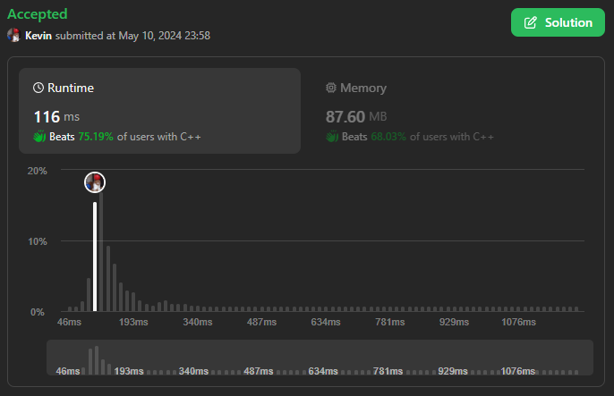

# 3095. Shortest Subarray With OR at Least K I

## Énoncé

On vous donne un tableau `nums` d'entiers **non négatifs** et un entier `k`.

Un tableau est appelé **spécial** si le `OR` bit à bit de tous ses éléments est **au moins** `k`.

Retournez la longueur du **plus court sous-tableau spécial non vide** de `nums`, ou retournez `-1` s'il n'existe pas de sous-tableau spécial.

Cet exercice est le meme que [3095. Shortest Subarray With OR at Least K I](../3095.%20Shortest%20Subarray%20With%20OR%20at%20Least%20K%20I/), seules les contrainte de l'entrée change.

## Exemple

**Exemple 1:**  
**Input:** nums = [1,2,3], k = 2  
**Output:** 1  
**Explication:** Le sous-tableau `[3]` a une valeur `OR` de `3`. Donc, nous retournons `1`.

**Exemple 2:**  
**Input:** nums = [2,1,8], k = 10  
**Output:** 3  
**Explication:** Le sous-tableau `[2,1,8]` a une valeur `OR` de `11`. Donc, nous retournons `3`.

**Exemple 3:**  
**Input:** nums = [1,2], k = 0  
**Output:** 1  
**Explication:** Le sous-tableau `[1]` a une valeur `OR` de `1`. Donc, nous retournons `1`.

## Contraintes

`1 <= nums.length <= 2 * 10^5`  
`0 <= nums[i] <= 10^9`  
`0 <= k <= 10^9`

## Note personnelle

Sur la page [3095. Shortest Subarray With OR at Least K I](../3095.%20Shortest%20Subarray%20With%20OR%20at%20Least%20K%20I/), vous trouverez toutes les explications nécessaires. Cependant, en raison des contraintes plus strictes de cet exercice, seule la solution utilisant la méthode "Sliding Window" avec une complexité temporelle de `O(n)` réussit à passer tous les jeux de tests.

