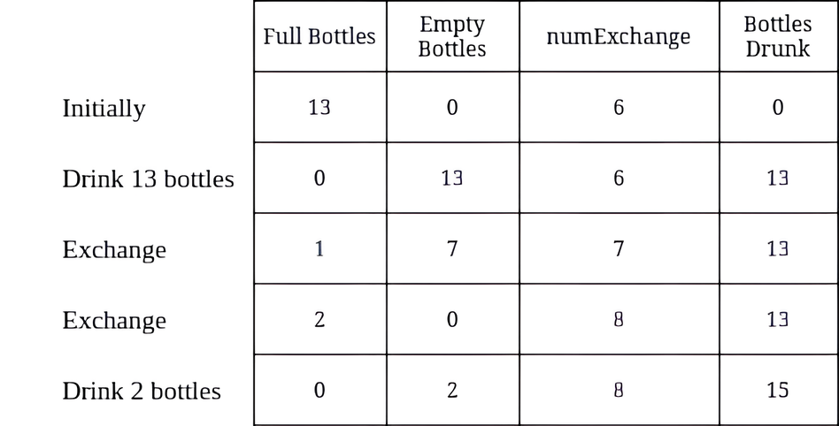
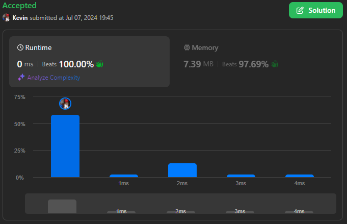
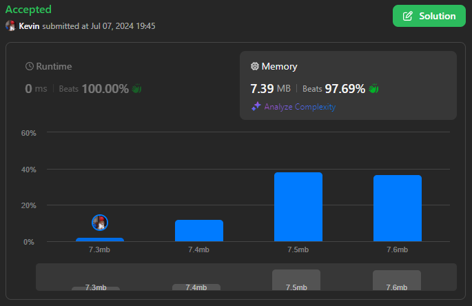

# 3100. Water Bottles II

## Énoncé

On vous donne deux entiers `numBottles` et `numExchange`.

`numBottles` représente le nombre de bouteilles d'eau pleines que vous avez initialement. En une opération, vous pouvez effectuer l'une des opérations suivantes:

- Boire un nombre quelconque de bouteilles d'eau pleines en les transformant en bouteilles vides.
- Échanger `numExchange` bouteilles vides contre une bouteille pleine. Ensuite, augmentez `numExchange` de un.

Notez que vous ne pouvez pas échanger plusieurs lots de bouteilles vides pour la même valeur de `numExchange`. Par exemple, si `numBottles == 3` et `numExchange == 1`, vous ne pouvez pas échanger `3` bouteilles d'eau vides contre `3` bouteilles pleines.

Retournez le **nombre maximum** de bouteilles d'eau que vous pouvez boire.

## Exemple

**Exemple 1:**



**Input:** numBottles = 13, numExchange = 6  
**Output:** 15

**Exemple 2:**


**Input:** numBottles = 10, numExchange = 3  
**Output:** 13

## Contraintes

`1 <= numBottles <= 100`  
`1 <= numExchange <= 100`

## Note personnelle

### Approche 1: Simulation

L'idée de cette approche est de simuler chaque étape jusqu'à ce qu'il ne reste plus de bouteilles pleines.

```cpp
int maxBottlesDrunk(int numBottles, int numExchange) {
  int ans = 0; // Variable pour stocker le nombre total de bouteilles bues

  // Boucle tant que le nombre de bouteilles actuelles est suffisant pour un échange
  while(numBottles >= numExchange){
    // Ajouter le nombre de bouteilles échangées à la somme totale des bouteilles bues
    ans += numExchange;
    // Réduire le nombre de bouteilles actuelles du nombre échangé
    numBottles -= numExchange;
    // Ajouter une nouvelle bouteille obtenue par échange
    numBottles++;
    // Incrémenter le nombre de bouteilles nécessaires pour le prochain échange
    numExchange++;
  }

  // Retourner le nombre de bouteilles bues
  return ans + numBottles;
}
```

- Complexité Temporelle: `O(numBottles/numExchange)`.
- Complexité Spatiale: `O(1)`.

### Approche 2 Mathématique:

Cette approche n'est pas la mienne, elle a été publiée par [khamit_sk](https://leetcode.com/u/khamit_sk/) sur LeetCode [ici](https://leetcode.com/problems/water-bottles-ii/solutions/4972465/constant-time-solution-with-python3/).

```cpp
int maxBottlesDrunk(int numBottles, int numExchange) {
  numBottles -= 1;
  int D = pow(2 * numExchange - 3, 2) + 8 * numBottles;
  int res = (-(2 * numExchange - 3) + sqrt(D)) / 2;

  return numBottles + res + 1;
}
```

- Complexité Temporelle: `O(1)`.
- Complexité Spatiale: `O(1)`.



