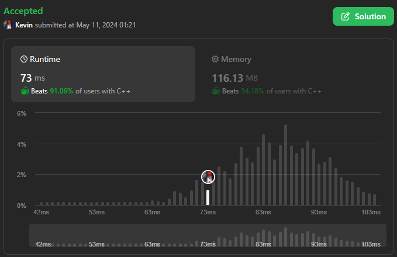
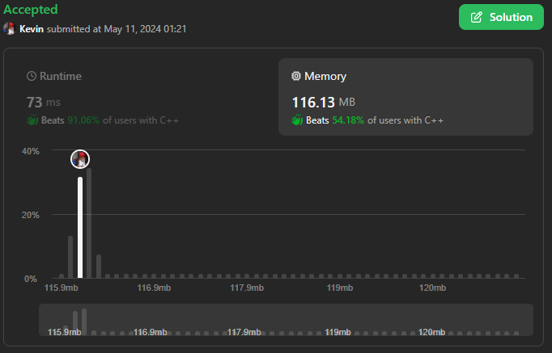

# 3101. Count Alternating Subarrays

## Énoncé

Vous disposez d'un tableau binaire `nums`.

Nous appelons un sous-tableau **alternatif** si **aucun des éléments adjacents** dans le sous-tableau n'a la **même** valeur.

Retournez le nombre de sous-tableaux alternatifs dans `nums`.

## Exemple

**Exemple 1:**  
**Input:** nums = [0,1,1,1]  
**Output:** 5  
**Explication:**  
Les sous-tableaux suivants alternent: `[0]`, `[1]`, `[1]`, `[1]`, et `[0,1]`.

**Exemple 2:**  
**Input:** nums = [1,0,1,0]  
**Output:** 10  
**Explication:**  
Chaque sous-tableau du tableau est en alternance. Il existe 10 sous-tableaux possibles.

## Contraintes

`1 <= nums.length <= 10^5`  
`nums[i]` est `0` ou `1`.

## Note personnelle

J'ai traité le problème en le considérant un peu comme un exercice de "Sliding Window", du moins dans ses grandes lignes.

L'idée consiste à maintenir en permanence une trace de l'indice du premier élément du sous-tableau alternant. Si le tableau alterne, nous ajoutons à notre réponse sa longueur ; sinon, nous redéfinissons la variable `left` avec comme valeur `i`.

La réponse est initialisée au départ à `nums.size()`, ce qui évite de l'incrémenter de 1 à chaque itération.

Cette approche présente une complexité temporelle de `O(n)` et une complexité spatiale de `O(1)`.

