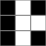
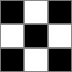
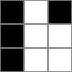

# 3127. Make a Square with the Same Color

## Énoncé

On vous donne une matrice 2D `grid` de taille `3 x 3` composée uniquement des caractères `'B'` et `'W'`. Le caractère `'W'` représente la couleur blanche et le caractère `'B'` représente la couleur noire.

Ton objectif est de changer la couleur **d'au plus une** cellule pour que la matrice ait un carré `2 x 2` où toutes les cellules sont de la même couleur.

Renvoie `true` s'il est possible de créer un carré `2 x 2` de la même couleur, sinon, renvoie `false`.

## Exemple

**Exemple 1:**

**Input:** grid = [["B","W","B"],["B","W","W"],["B","W","B"]]  
**Output:** true  
**Explication:** Changer grid[0][2] permet d'obtenir un carré de 2x2 blanc.

**Exemple 2:**

**Input:** grid = [["B","W","B"],["W","B","W"],["B","W","B"]]  
**Output:** false  
**Explication:** Changer une cellule ne permet pas d'obtenir un carré de 2x2 de la même couleur.

**Exemple 3:**

**Input:** grid = [["B","W","B"],["B","W","W"],["B","W","W"]]  
**Output:** true  
**Explication:** La grille contient déjà un carré de 2x2 de la même couleur.

## Contraintes

`grid.length == 3`  
`grid[i].length == 3`  
`grid[i][j]` est `'W'` ou `'B'`.

## Note personnelle

Mon approche consiste à itérer sur le coin supérieur gauche de chaque carré de 2x2.

Ensuite, je compte le nombre d'éléments de la même couleur que la cellule du coin supérieur gauche (en la considérant). Si on compte 2 cellules alors en changeant une cellule on ne peut pas obtenir un carré uniforme.

Cette approche présente une complexité temporelle de `O(n^2)` et une complexité spatiale de `O(1)`.

