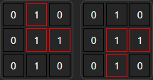
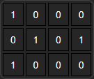
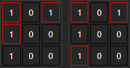
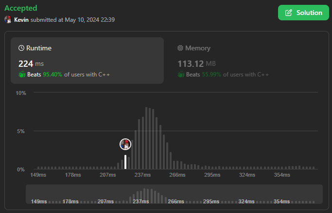

# 3128. Right Triangles

## Énoncé

Vous avez une matrice booléenne 2D nommée `grid`.

Renvoyez un entier qui représente le nombre de **triangles rectangles** qui peuvent être formés avec 3 éléments de `grid` tels que **tous** ces éléments ont une valeur de 1.

Un ensemble de 3 éléments dans `grid` forme un **triangle rectangle** si l'un de ses éléments est dans la **même ligne** et qu'un autre élément et dans la **même colonne** que le troisième élément. Les 3 éléments ne doivent pas nécessairement être adjacents.

## Exemple

**Exemple 1:**

**Input:** grid = [[0,1,0],[0,1,1],[0,1,0]]  
**Output:** 2

**Exemple 2:**

**Input:** grid = [[1,0,0,0],[0,1,0,1],[1,0,0,0]]  
**Output:** 0

**Exemple 3:**

**Input:** grid = [[1,0,1],[1,0,0],[1,0,0]]  
**Output:** 2

## Contraintes

`1 <= grid.length <= 1000`  
`1 <= grid[i].length <= 1000`  
`0 <= grid[i][j] <= 1`

## Note personnelle

Pour résoudre ce problème, ma solution nécessite de parcourir la grille deux fois.

Lors du premier passage, je conserve pour chaque ligne/colonne le nombre de 1 qu'elle contient. Ces valeurs sont stockées dans deux vecteurs `rows` et `cols`.

Lors du second passage, je calcule le nombre de triangles rectangles. En supposant que chaque rencontre d'un `1`peut potentiellement former l'angle droit d'un triangle rectangle, le nombre de triangles de cette case est `(rows[i] - 1) * (cols[j] - 1)`.

Cette approche présente une complexité temporelle de `O(n * m)` et une complexité spatiale de `O(n + m)`.

