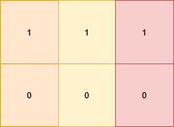

# 3142. Check if Grid Satisfies Conditions

## Énoncé

On vous donne une matrice 2D `grid` de taille `m x n`. Vous devez vérifier si chaque cellule `grid[i][j]` est:

- gale à la cellule en dessous d'elle, c'est-à-dire `grid[i][j] == grid[i + 1][j]` (si elle existe).
- Différente de la cellule à sa droite, c'est-à-dire `grid[i][j] != grid[i][j + 1]` (si elle existe).

Retournez `true` si toutes les cellules satisfont ces conditions, sinon, retournez `false`.

## Exemple

**Exemple 1:**


**Input:** grid = [[1,0,2],[1,0,2]]  
**Output:** true  
**Explication:** Toutes les cellules de la grille satisfont les conditions.

**Exemple 2:**



**Input:** grid = [[1,1,1],[0,0,0]]  
**Output:** false  
**Explication:** Toutes les cellules de la première ligne sont égales.

**Exemple 3:**


**Input:** grid = [[1],[2],[3]]  
**Output:** false  
**Explication:** Les cellules de la première colonne ont des valeurs différentes.

## Contraintes

`1 <= n, m <= 10`  
`0 <= grid[i][j] <= 9`

## Note personnelle

Ma première approche consistait à appliquer directement les conditions décrites dans l'énoncé à chaque cellule de la grille.

```cpp
bool satisfiesConditions(vector<vector<int>>& grid) {
  // Parcourt chaque ligne de la grille
  for(int i = 0; i < grid.size(); i++){
    // Parcourt chaque colonne de la grille
    for(int j = 0; j < grid[0].size(); j++){
      // Vérifie si l'élément en dessous de la position actuelle est différent
      if(i + 1 < grid.size() && grid[i + 1][j] != grid[i][j]){
        return false; // Condition non satisfaite, retourne false
      }
      // Vérifie si l'élément à droite de la position actuelle est identique
      if(j + 1 < grid[0].size() && grid[i][j + 1] == grid[i][j]){
        return false; // Condition non satisfaite, retourne false
      }
    }
  }
  // Si toutes les conditions sont satisfaites, retourne true
  return true;
}
```

La complexité temporelle de cette approche est de `O(n * m)` et la complexité spatiale est de `O(1)`.

Une autre approche consiste à parcourir la grille par colonne. En procédant ainsi, on peut supprimer une condition de la boucle imbriquée et la déplacer uniquement dans la boucle principale. Bien que cette optimisation soit minime, elle peut être bénéfique pour des grilles de grande taille.

```cpp
bool satisfiesConditions(vector<vector<int>>& grid) {
  // Parcourir chaque colonne
  for(int j = 0; j < grid[0].size(); j++){
    // Récupérer l'élément courant dans la première ligne
    int curr = grid[0][j];

    // Parcourir les autres lignes de la même colonne
    for(int i = 1; i < grid.size(); i++){
      // Si un élément dans la même colonne est différent de l'élément courant, retourner false
      if(grid[i][j] != curr){
        return false;
      }
    }

    // Si l'élément courant n'est pas le dernier élément de la ligne
    // et qu'il est identique a l'élément de la colonene suivante, retourner false
    if(j != grid[0].size() - 1 && curr == grid[0][j + 1]){
      return false;
    }
  }

  // Si toutes les conditions sont satisfaites, retourner true
  return true;
}
```

La complexité temporelle et spatiale reste inchangée.

### Comparaison des approches

- **Première approche**: Cette méthode est plus intuitive pour ceux qui préfèrent parcourir la grille élément par élément. Cependant, chaque élément est vérifié deux fois, ce qui peut entraîner un surcoût.

- **Deuxième approche**: Cette méthode a l'avantage de vérifier chaque colonne indépendamment, ce qui peut être plus simple et plus rapide avec moins de vérifications par élément. L'inconvénient est que le code peut être moins intuitif car il parcourt les colonnes avant les lignes.


