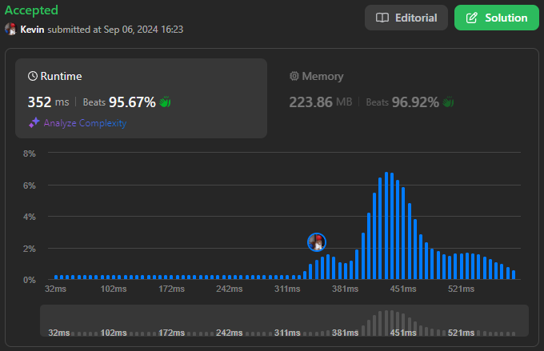
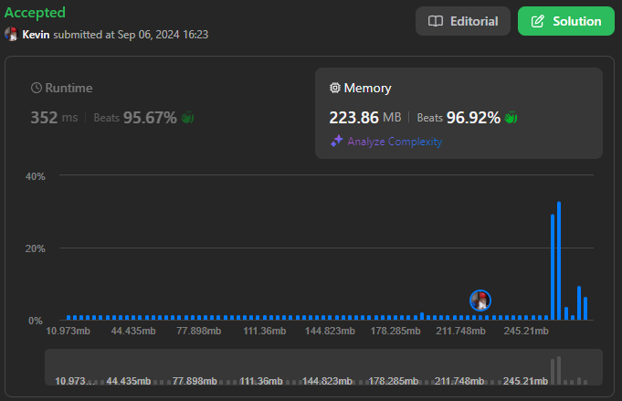

# 3217. Delete Nodes From Linked List Present in Array

## Énoncé

Vous recevez un tableau d'entiers `nums` et la `head` d'une liste chaînée. Retournez la `head` de la liste chaînée modifiée après **avoir supprimé** tous les nœuds de la liste chaînée dont la valeur existe dans `nums`.

## Exemple

**Exemple 1:**  
**Input:** nums = [1,2,3], head = [1,2,3,4,5]  
**Output:** [4,5]  
**Explication:**  
  
Supprimez les nœuds ayant les valeurs 1, 2 et 3.

**Exemple 2:**  
**Input:** nums = [1], head = [1,2,1,2,1,2]  
**Output:** [2,2,2]  
**Explication:**  
  
Supprimez les nœuds ayant la valeur 1.

**Exemple 2:**  
**Input:** nums = [5], head = [1,2,3,4]  
**Output:** [1,2,3,4]  
**Explication:**  
  
Aucun nœud n'a la valeur 5.

## Contraintes

`1 <= nums.length <= 10^5`  
`1 <= nums[i] <= 10^5`  
Tous les éléments dans `nums` sont uniques.  
Le nombre de nœuds dans la liste donnée est dans la plage `[1, 10^5]`.  
`1 <= Node.val <= 10^5`  
L'entrée est générée de telle sorte qu'il y a au moins un nœud dans la liste chaînée ayant une valeur non présente dans `nums`.

## Note personnelle

### Approche 1 : Utilisation d'un Ensemble

Cette approche consiste à utiliser un ensemble pour vérifier si un élément est présent dans `nums`.

```cpp
ListNode* modifiedList(vector<int>& nums, ListNode* head) {
  // Créer un ensemble (unordered_set) contenant les valeurs à supprimer
  unordered_set<int> valuesToRemove(nums.begin(), nums.end());

  // Créer un noeud 'dummy' pour simplifier la gestion des suppressions en tête de liste
  ListNode* dummy = new ListNode(-1, head);
  ListNode* curr = dummy->next; // Noeud courant, commence au premier noeud de la liste
  ListNode* prev = dummy;       // Noeud précédent, commence au noeud 'dummy'

  // Parcourir la liste chaînée
  while(curr){
    // Si la valeur du noeud courant est dans l'ensemble
    if(valuesToRemove.find(curr->val) != valuesToRemove.end()){
      // Supprimer le noeud courant
      prev->next = curr->next;
    }
    else{
      // Sinon, avancer le pointeur 'prev' au noeud courant
      prev = curr;
    }
    // Avancer le pointeur 'curr' au prochain noeud
    curr = curr->next;
  }

  // Retourner la tête de la liste modifiée
  return dummy->next;
}
```

- Complexité Temporelle: `O(n + m)`.
- Complexité Spatiale: `O(m)`.

où `n` st le nombre d'éléments dans la liste et `m` le nombre d'éléments dans `nums`.

### Approche 2: Approche 2 : Tri + Recherche Binaire

L'idée ici est d'utiliser une recherche binaire pour localiser les éléments à supprimer après avoir trié `nums`

```cpp
// Fonction pour effectuer une recherche binaire dans un vecteur trié
bool binarySearch(vector<int> &nums, int n){
  int start = 0;
  int end = nums.size() - 1;

  while(start <= end){
    int mid = start + ((end - start) / 2);

    if(nums[mid] == n){
      return true;
    }

    if(nums[mid] > n){
      end = mid - 1;
    }
    else{
      start = mid + 1;
    }
  }

  return false;
}

ListNode* modifiedList(vector<int>& nums, ListNode* head) {
  // Trier les valeurs dans 'nums' pour permettre la recherche binaire
  sort(nums.begin(), nums.end());

  // Créer un noeud 'dummy' pour simplifier la gestion des suppressions en tête de liste
  ListNode* dummy = new ListNode(-1, head);
  ListNode* curr = dummy->next; // Noeud courant, commence au premier noeud de la liste
  ListNode* prev = dummy;       // Noeud précédent, commence au noeud 'dummy'

  // Parcourir la liste chaînée
  while(curr){
    // Si la valeur du noeud courant est dans 'nums'
    if(binarySearch(nums, curr->val)){
      // Supprimer le noeud courant
      prev->next = curr->next;
    }
    else{
      // Sinon, avancer le pointeur 'prev' au noeud courant
      prev = curr;
    }
    // Avancer le pointeur 'curr' au prochain noeud
    curr = curr->next;
  }

  // Retourner la tête de la liste modifiée
  return dummy->next;
}
```

- Complexité Temporelle: `O(n log m + m log m)`.
- Complexité Spatiale: `O(1)`.

### Approche 3: Approche 3 : Tableau de Booléens / Bitset

Si les valeurs de `nums` sont dans un intervalle restreint, on peut utiliser un tableau de booléens (ou un `bitset` pour économiser de la mémoire) pour marquer les valeurs à supprimer.

```cpp
ListNode* modifiedList(vector<int>& nums, ListNode* head) {
  bitset<100001> toDelete;

  for(int n : nums){
    toDelete[n] = 1;
  }

  ListNode* dummy = new ListNode(-1, head);
  ListNode* curr = dummy->next;
  ListNode* prev = dummy;

  while(curr){
    // Si la valeur du noeud courant est dans 'nums'
    if(toDelete[curr->val]){
      // Supprimer le noeud courant
      prev->next = curr->next;
    }
    else{
      // Sinon, avancer le pointeur 'prev' au noeud courant
      prev = curr;
    }
    // Avancer le pointeur 'curr' au prochain noeud
    curr = curr->next;
  }

  // Retourner la tête de la liste modifiée
  return dummy->next;
}
```

- Complexité Temporelle: `O(n + m)`.
- Complexité Spatiale: `O(1)`.

### Gestion des fuites de mémoire

Pour corriger les fuites de mémoire, il suffit d'ajuster le code comme suit :

```cpp
while(curr){
  if( {is in nums} ){
    prev->next = curr->next;
    ListNode* temp = curr->next;
    delete curr;
    curr = temp;
  }
  else{
    prev = curr;
    curr = curr->next;
  }
}
```

Il faut egalement supprimer le noeud factice à la fin

```cpp
ListNode* ans = dummy->next;
delete dummy;

return ans;
```

### Comparaison des différentes approches

Rapport de performance généré avec [Benchmark Algorithm](https://github.com/SlicedPotatoes/BenchmarkAlgorithm).

Les performances des différentes approches sont évaluées comme suit. Les tests ont été réalisés avec x jeux de données de tailles variées:

**100 jeux de données de taille 100 pour la liste et 100 pour nums**:

```cpp
Ensemble -  Mean: 35.859 µs, Min: 31.800 µs, Max: 57.500 µs, Median: 34.300 µs, Total: 3.586 ms
Sort + BS - Mean: 17.858 µs, Min: 16.600 µs, Max: 38.000 µs, Median: 17.500 µs, Total: 1.786 ms
Bitset -    Mean: 3.948 µs,  Min: 3.300 µs,  Max: 33.700 µs, Median: 3.500 µs,  Total: 394.800 µs
Array -     Mean: 6.676 µs,  Min: 5.300 µs,  Max: 28.200 µs, Median: 5.800 µs,  Total: 667.600 µs
```

**100 jeux de données de taille 20000 pour la liste et 100 pour nums**:

```
Ensemble -  Mean: 1.810 ms,   Min: 1.518 ms,   Max: 11.002 ms,  Median: 1.656 ms,   Total: 180.970 ms
Sort + BS - Mean: 1.504 ms,   Min: 1.301 ms,   Max: 3.490 ms,   Median: 1.425 ms,   Total: 150.418 ms
Bitset -    Mean: 298.840 µs, Min: 251.400 µs, Max: 627.800 µs, Median: 282.650 µs, Total: 29.884 ms
Array -     Mean: 472.473 µs, Min: 410.700 µs, Max: 738.600 µs, Median: 450.950 µs, Total: 47.247 ms
```

**100 jeux de données de taille 100 pour la liste et 75000 pour nums**:

```
Ensemble -  Mean: 22.167 ms, Min: 21.260 ms, Max: 46.291 ms, Median: 21.715 ms, Total: 2.217 s
Sort + BS - Mean: 16.106 ms, Min: 15.731 ms, Max: 17.138 ms, Median: 16.097 ms, Total: 1.611 s
Bitset -    Mean: 1.315 ms,  Min: 1.285 ms,  Max: 1.365 ms,  Median: 1.317 ms,  Total: 131.531 ms
Array -     Mean: 1.945 ms,  Min: 1.901 ms,  Max: 2.018 ms,  Median: 1.946 ms,  Total: 194.487 ms
```

**100 jeux de données de taille 20000 pour la liste et 75000 pour nums**:

```
Ensemble -  Mean: 25.687 ms, Min: 23.726 ms, Max: 47.676 ms, Median: 24.449 ms, Total: 2.569 s
Sort + BS - Mean: 19.667 ms, Min: 19.225 ms, Max: 20.956 ms, Median: 19.676 ms, Total: 1.967 s
Bitset -    Mean: 1.954 ms,  Min: 1.909 ms,  Max: 2.146 ms,  Median: 1.957 ms,  Total: 195.410 ms
Array -     Mean: 2.725 ms,  Min: 2.659 ms,  Max: 2.973 ms,  Median: 2.724 ms,  Total: 272.460 ms
```

L'analyse des résultats montre que l'approche utilisant un `bitset` est la plus performante, suivie par l'approche utilisant un `array`, à travers tous les jeux de données. Ces deux approches semblent être particulièrement optimisées pour ce problème et ses contraintes spécifiques. Il est important de noter que dans des situations réelles, ces optimisations pourraient ne pas toujours être applicables.

Pour une comparaison plus approfondie entre les approches utilisant un ensemble et celle utilisant une recherche binaire, les résultats sont résumés dans le tableau ci-dessous:

| Algoritme | Test 1 | Test 2 | Test 3 | Test 4 |
| --------- | ------ | ------ | ------ | ------ |
| Ensemble  | 200%   | 120%   | 137%   | 130%   |
| Sort + BS | 100%   | 100%   | 100%   | 100%   |

Ce tableau montre la différence de performance entre les deux approches sous forme de pourcentage. L'augmentation de la taille de la liste a un impact beaucoup plus significatif que l'augmentation de la taille de `nums` sur l'approche utilisant la recherche binaire.

Malgré ces observations, je n'ai pas pu déterminer le point de basculement où l'algorithme utilisant un ensemble deviendrait plus performant que l'approche avec recherche binaire pour certaines tailles de liste et de `nums` en raison de problèmes avec mon logiciel de benchmark.

**Conclusion**:

- **L'approche bitset**: Meilleur compromis temps/mémoire, idéal pour les scénarios où les valeurs de `nums` sont dans un intervalle restreint.
- **L'approche Tri + Recherche binaire**: Solution intermédiaire, particulièrement utile lorsque `nums` est petit.
- **L'approche Ensemble**: Bonne performance pour des tailles variées de données, mais plus coûteux en mémoire.

Les jeux de test ont été générés avec la fonction suivante:

```cpp
TC generateRandomData(int n, int m)
{
    Input input;

    std::random_device rd;
    std::mt19937 gen(rd());

    // Générer LinkedList
    std::uniform_int_distribution<> dist(1, 99999);

    ListNode<int> *dummy = new ListNode<int>(-1);
    ListNode<int> *dummyR = new ListNode<int>(-1);
    ListNode<int> *curr = dummy;
    ListNode<int> *currR = dummyR;

    for (int i = 0; i < n; i++)
    {
        int element = dist(gen);
        curr->next = new ListNode<int>(element);
        currR->next = new ListNode<int>(element);

        curr = curr->next;
        currR = currR->next;
    }

    curr->next = new ListNode<int>(100000);
    currR->next = new ListNode<int>(100000);

    // Générer nums
    unordered_set<int> e;
    while (e.size() != m)
    {
        e.insert(dist(gen));
    }
    vector<int> nums(e.begin(), e.end());

    get<0>(input) = dummy->next;
    get<1>(input) = nums;

    // Récupérer le résultat
    unordered_set<int> valuesToRemove(nums.begin(), nums.end());

    ListNode<int> *t = new ListNode<int>(-1, dummyR->next);
    ListNode<int> *c = t->next;
    ListNode<int> *prev = t;

    while (c)
    {
        if (valuesToRemove.find(c->val) != valuesToRemove.end())
        {
            prev->next = c->next;
            ListNode<int> *temp = c->next;
            delete c;
            c = temp;
        }
        else
        {
            prev = c;
            c = c->next;
        }
    }

    ListNode<int> *ans = t->next;
    delete dummy;

    // Renvoyer le TestCase
    return TC(input, ans);
}
```



