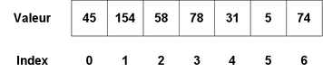

# Array

## Principe

Un **Array** ou **Tableau** est une structure de données permettant de stocker des éléments. Ils ont généralement une taille définie et les éléments peuvent être récupérés de manière constante en fonction de leur position dans le tableau.

Un tableau peut avoir plusieurs dimensions si ses éléments sont eux-mêmes des tableaux.

Illustration d'un tableau a une dimension:  

### Facile

| Label                                                                                                                                             | Tags                                                                                                                                                            | Date       |
| ------------------------------------------------------------------------------------------------------------------------------------------------- | --------------------------------------------------------------------------------------------------------------------------------------------------------------- | ---------- |
| [1. Two Sum](../Probleme/0001.%20Two%20Sum/)                                                                                                      | [`Array`](./array.md), [`Hash Table`](./hash_table.md)                                                                                                          | 18-02-2024 |
| [26. Remove Duplicates from Sorted Array](../Probleme/0026.%20Remove%20Duplicates%20from%20Sorted%20Array/)                                       | [`Array`](./array.md), [`Two Pointers`](./two_pointers.md)                                                                                                      | 29-03-2024 |
| [27. Remove Element](../Probleme/0026.%20Remove%20Duplicates%20from%20Sorted%20Array/)                                                            | [`Array`](./array.md), [`Two Pointers`](./two_pointers.md)                                                                                                      | 29-03-2024 |
| [35. Search Insert Position](../Probleme/0035.%20Search%20Insert%20Position/)                                                                     | [`Array`](./array.md), [`Binary Search`](./binary_search.md)                                                                                                    | 09-03-2024 |
| [66. Plus One](../Probleme/0066.%20Plus%20One/)                                                                                                   | [`Array`](./array.md), [`Math`](./math.md)                                                                                                                      | 29-03-2024 |
| [88. Merge Sorted Array](../Probleme/0088.%20Merge%20Sorted%20Array/)                                                                             | [`Array`](./array.md), [`Two Pointers`](./two_pointers.md), [`Sorting`](./sorting.md)                                                                           | 21-02-2024 |
| [118. Pascal's Triangle](../Probleme/0118.%20Pascal's%20Triangle/)                                                                                | [`Array`](./array.md), [`Dynamic Programming`](./dp.md)                                                                                                         | 07-03-2024 |
| [119. Pascal's Triangle II](../Probleme/0119.%20Pascal's%20Triangle%20II/)                                                                        | [`Array`](./array.md), [`Dynamic Programming`](./dp.md)                                                                                                         | 07-03-2024 |
| [121. Best Time to Buy and Sell Stock](../Probleme/0121.%20Best%20Time%20to%20Buy%20and%20Sell%20Stock/)                                          | [`Array`](./array.md), [`Dynamic Programming`](./dp.md)                                                                                                         | 07-03-2024 |
| [169. Majority Element](../Probleme/0169.%20Majority%20Element/)                                                                                  | [`Array`](./array.md), [`Hash Table`](./hash_table.md), [`Divide and Conquer`](./divide_and_conquer.md), [`Sorting`](./sorting.md), [`Counting`](./counting.md) | 12-04-2024 |
| [219. Contains Duplicate II](../Probleme/0219.%20Contains%20Duplicate%20II/)                                                                      | [`Array`](./array.md), [`Hash Table`](./hash_table.md), [`Sliding Window`](./sliding_window.md)                                                                 | 30-03-2024 |
| [228. Summary Ranges](../Probleme/0228.%20Summary%20Ranges/)                                                                                      | [`Array`](./array.md)                                                                                                                                           | 31-03-2024 |
| [283. Move Zeroes](../Probleme/0283.%20Move%20Zeroes/)                                                                                            | [`Array`](./array.md), [`Two Pointers`](./two_pointers.md)                                                                                                      | 12-03-2024 |
| [303. Range Sum Query - Immutable](../Probleme/0303.%20Range%20Sum%20Query%20-%20Immutable/)                                                      | [`Array`](./array.md), [`Design`](./design.md), [`Prefix Sum`](./prefix_sum.md)                                                                                 | 26-02-2024 |
| [349. Intersection of Two Arrays](../Probleme/0349.%20Intersection%20of%20Two%20Arrays/)                                                          | [`Array`](./array.md), [`Hash Table`](./hash_table.md), [`Binary Search`](./binary_search.md), [`Sorting`](./sorting.md)                                        | 10-03-2024 |
| [463. Island Perimeter](../Probleme/0463.%20Island%20Perimeter/)                                                                                  | [`Array`](./array.md), [`Depth-First Search`](./dfs.md), [`Breadth-First Search`](./bfs.md), [`Matrix`](./matrix.md)                                            | 27-04-2024 |
| [575. Distribute Candies](../Probleme/0575.%20Distribute%20Candies/)                                                                              | [`Array`](./array.md), [`Hash Table`](./hash_table.md)                                                                                                          | 28-04-2024 |
| [605. Can Place Flowers](../Probleme/0605.%20Can%20Place%20Flowers/)                                                                              | [`Array`](./array.md), [`Greedy`](./greedy.md)                                                                                                                  | 20-02-2024 |
| [643. Maximum Average Subarray I](../Probleme/0643.%20Maximum%20Average%20Subarray%20I/)                                                          | [`Array`](./array.md), [`Sliding Window`](./sliding_window.md)                                                                                                  | 13-03-2024 |
| [704. Binary Search](../Probleme/0704.%20Binary%20Search/)                                                                                        | [`Array`](./array.md), [`Binary Search`](./binary_search.md)                                                                                                    | 09-03-2024 |
| [706. Design HashMap](../Probleme/0706.%20Design%20HashMap/)                                                                                      | [`Array`](./array.md), [`Hash Table`](./hash_table.md), [`Linked List`](./linked_list.md), [`Design`](./design.md), `Hash Function`                             | 09-03-2024 |
| [717. 1-bit and 2-bit Characters](../Probleme/0717.%201-bit%20and%202-bit%20Characters/)                                                          | [`Array`](./array.md)                                                                                                                                           | 27-04-2024 |
| [724. Find Pivot Index](../Probleme/0724.%20Find%20Pivot%20Index/)                                                                                | [`Array`](./array.md), [`Prefix Sum`](./prefix_sum.md)                                                                                                          | 26-02-2024 |
| [744. Find Smallest Letter Greater Than Target](../Probleme/0744.%20Find%20Smallest%20Letter%20Greater%20Than%20Target/)                          | [`Array`](./array.md), [`Binary Search`](./binary_search.md)                                                                                                    | 09-03-2024 |
| [746. Min Cost Climbing Stairs](../Probleme/0746.%20Min%20Cost%20Climbing%20Stairs/)                                                              | [`Array`](./array.md), [`Dynamic Programming`](./dp.md)                                                                                                         | 08-03-2024 |
| [977. Squares of a Sorted Array](../Probleme/0977.%20Squares%20of%20a%20Sorted%20Array/)                                                          | [`Array`](./array.md), [`Two Pointers`](./two_pointers.md), [`Sorting`](./sorting.md)                                                                           | 02-03-2024 |
| [997. Find the Town Judge](../Probleme/0997.%20Find%20the%20Town%20Judge/)                                                                        | [`Array`](./array.md), [`Hash Table`](./hash_table.md), [`Graph`](./graph.md)                                                                                   | 22-02-2024 |
| [1207. Unique Number of Occurrences](../Probleme/1207.%20Unique%20Number%20of%20Occurrences/)                                                     | [`Array`](./array.md), [`Hash Table`](./hash_table.md)                                                                                                          | 16-03-2024 |
| [1351. Count Negative Numbers in a Sorted Matrix](../Probleme/1351.%20Count%20Negative%20Numbers%20in%20a%20Sorted%20Matrix/)                     | [`Array`](./array.md), [`Binary Search`](./binary_search.md), [`Matrix`](./matrix.md)                                                                           | 09-03-2024 |
| [1413. Minimum Value to Get Positive Step by Step Sum](../Probleme/1413.%20Minimum%20Value%20to%20Get%20Positive%20Step%20by%20Step%20Sum/)       | [`Array`](./array.md), [`Prefix Sum`](./prefix_sum.md)                                                                                                          | 27-02-2024 |
| [1431. Kids With the Greatest Number of Candies](../Probleme/1431.%20Kids%20With%20the%20Greatest%20Number%20of%20Candies/)                       | [`Array`](./array.md)                                                                                                                                           | 20-02-2024 |
| [1480. Running Sum of 1d Array](../Probleme/1480.%20Running%20Sum%20of%201d%20Array/)                                                             | [`Array`](./array.md), [`Prefix Sum`](./prefix_sum.md)                                                                                                          | 27-02-2024 |
| [1588. Sum of All Odd Length Subarrays](../Probleme/1588.%20Sum%20of%20All%20Odd%20Length%20Subarrays/)                                           | [`Array`](./array.md), [`Prefix Sum`](./prefix_sum.md), [`Math`](./math.md)                                                                                     | 27-02-2024 |
| [1732. Find the Highest Altitude](../Probleme/1732.%20Find%20the%20Highest%20Altitude/)                                                           | [`Array`](./array.md), [`Prefix Sum`](./prefix_sum.md)                                                                                                          | 28-02-2024 |
| [1854. Maximum Population Year](../Probleme/1854.%20Maximum%20Population%20Year/)                                                                 | [`Array`](./array.md), [`Prefix Sum`](./prefix_sum.md), [`Counting`](./counting.md)                                                                             | 26-02-2024 |
| [1893. Check if All the Integers in a Range Are Covered](../Probleme/1893.%20Check%20if%20All%20the%20Integers%20in%20a%20Range%20Are%20Covered/) | [`Array`](./array.md), [`Prefix Sum`](./prefix_sum.md), [`Hash Table`](./hash_table.md)                                                                         | 26-02-2024 |
| [1991. Find the Middle Index in Array](../Probleme/1991.%20Find%20the%20Middle%20Index%20in%20Array/)                                             | [`Array`](./array.md), [`Prefix Sum`](./prefix_sum.md)                                                                                                          | 26-02-2024 |
| [2215. Find the Difference of Two Arrays](../Probleme/2215.%20Find%20the%20Difference%20of%20Two%20Arrays/)                                       | [`Array`](./array.md), [`Hash Table`](./hash_table.md)                                                                                                          | 14-03-2024 |
| [2540. Minimum Common Value](../Probleme/2540.%20Minimum%20Common%20Value/)                                                                       | [`Array`](./array.md), [`Hash Table`](./hash_table.md), [`Two Pointers`](./two_pointers.md), [`Binary Search`](./binary_search.md)                              | 09-03-2024 |
| [3005. Count Elements With Maximum Frequency](../Probleme/3005.%20Count%20Elements%20With%20Maximum%20Frequency/)                                 | [`Array`](./array.md), [`Hash Table`](./hash_table.md), [`Counting`](./counting.md)                                                                             | 08-03-2024 |
| [3028. Ant on the Boundary](../Probleme/3028.%20Ant%20on%20the%20Boundary/)                                                                       | [`Array`](./array.md), [`Prefix Sum`](./prefix_sum.md), [`Simulation`](./simulation.md)                                                                         | 26-02-2024 |
| [3065. Minimum Operations to Exceed Threshold Value I](../Probleme/3065.%20Minimum%20Operations%20to%20Exceed%20Threshold%20Value%20I/)           | [`Array`](./array.md)                                                                                                                                           | 02-03-2024 |
| [3079. Find the Sum of Encrypted Integers](../Probleme/3079.%20Find%20the%20Sum%20of%20Encrypted%20Integers/)                                     | [`Array`](./array.md), [`Math`](./math.md)                                                                                                                      | 16-03-2024 |
| [3095. Shortest Subarray With OR at Least K I](../Probleme/3095.%20Shortest%20Subarray%20With%20OR%20at%20Least%20K%20I/)                         | [`Array`](./array.md), [`Bit Manipulation`](./bit_manipulation.md), [`Sliding Window`](./sliding_window.md)                                                     | 11-05-2024 |
| [3127. Make a Square with the Same Color](../Probleme/3127.%20Make%20a%20Square%20with%20the%20Same%20Color/)                                     | [`Array`](./array.md), [`Matrix`](./matrix.md), `Enumeration`                                                                                                   | 27-03-2024 |

### Moyen

| Label                                                                                                                                                         | Tags                                                                                                                                                               | Date       |
| ------------------------------------------------------------------------------------------------------------------------------------------------------------- | ------------------------------------------------------------------------------------------------------------------------------------------------------------------ | ---------- |
| [11. Container With Most Water](../Probleme/0011.%20Container%20With%20Most%20Water/)                                                                         | [`Array`](./array.md), [`Two Pointers`](./two_pointers.md), [`Greedy`](./greedy.md)                                                                                | 18-04-2024 |
| [33. Search in Rotated Sorted Array](../Probleme/0034.%20Find%20First%20and%20Last%20Position%20of%20Element%20in%20Sorted%20Array/)                          | [`Array`](./array.md), [`Binary Search`](./binary_search.md)                                                                                                       | 03-05-2024 |
| [34. Find First and Last Position of Element in Sorted Array](../Probleme/0034.%20Find%20First%20and%20Last%20Position%20of%20Element%20in%20Sorted%20Array/) | [`Array`](./array.md), [`Binary Search`](./binary_search.md)                                                                                                       | 09-03-2024 |
| [36. Valid Sudoku](../Probleme/0036.%20Valid%20Sudoku/)                                                                                                       | [`Array`](./array.md), [`Hash Table`](./hash_table.md), [`Matrix`](./matrix.md)                                                                                    | 25-03-2024 |
| [56. Merge Intervals](../Probleme/0056.%20Merge%20Intervals/)                                                                                                 | [`Array`](./array.md), [`Sorting`](./sorting.md)                                                                                                                   | 31-03-2024 |
| [57. Insert Interval](../Probleme/0057.%20Insert%20Interval/)                                                                                                 | [`Array`](./array.md)                                                                                                                                              | 17-03-2024 |
| [79. Word Search](../Probleme/0079.%20Word%20Search/)                                                                                                         | [`Array`](./array.md), [`String`](./string.md), [`Backtracking`](./backtracking.md), [`Matrix`](./matrix.md)                                                       | 03-04-2024 |
| [80. Remove Duplicates from Sorted Array II](../Probleme/0080.%20Remove%20Duplicates%20from%20Sorted%20Array%20II/)                                           | [`Array`](./array.md), [`Two Pointers`](./two_pointers.md)                                                                                                         | 29-03-2024 |
| [198. House Robber](../Probleme/0198.%20House%20Robber/)                                                                                                      | [`Array`](./array.md), [`Dynamic Programming`](./dp.md)                                                                                                            | 21-03-2024 |
| [200. Number of Islands](../Probleme/0200.%20Number%20of%20Islands/)                                                                                          | [`Array`](./array.md), [`Depth-First Search`](./dfs.md), [`Breadth-First Search`](./bfs.md), [`Union Find`](./union_find.md), [`Matrix`](./matrix.md)              | 19-04-2024 |
| [238. Product of Array Except Self](../Probleme/0238.%20Product%20of%20Array%20Except%20Self/)                                                                | [`Array`](./array.md), [`Prefix Sum`](./prefix_sum.md)                                                                                                             | 22-02-2024 |
| [289. Game of Life](../Probleme/0289.%20Game%20of%20Life/)                                                                                                    | [`Array`](./array.md), [`Matrix`](./matrix.md), [`Simulation`](./simulation.md)                                                                                    | 06-03-2024 |
| [334. Increasing Triplet Subsequence](../Probleme/0334.%20Increasing%20Triplet%20Subsequence/)                                                                | [`Array`](./array.md), [`Greedy`](./greedy.md)                                                                                                                     | 26-02-2024 |
| [380. Insert Delete GetRandom O(1)](<../Probleme/0380.%20Insert%20Delete%20GetRandom%20O(1)/>)                                                                | [`Array`](./array.md), [`Hash Table`](./hash_table.md), [`Math`](./math.md), [`Design`](./design.md), `Randomized`                                                 | 06-04-2024 |
| [442. Find All Duplicates in an Array](../Probleme/0442.%20Find%20All%20Duplicates%20in%20an%20Array/)                                                        | [`Array`](./array.md), [`Hash Table`](./hash_table.md)                                                                                                             | 25-02-2024 |
| [452. Minimum Number of Arrows to Burst Balloons](../Probleme/0452.%20Minimum%20Number%20of%20Arrows%20to%20Burst%20Balloons/)                                | [`Array`](./array.md), [`Greedy`](./greedy.md), [`Sorting`](./sorting.md)                                                                                          | 18-03-2024 |
| [542. 01 Matrix](../Probleme/0542.%2001%20Matrix/)                                                                                                            | [`Array`](./array.md), [`Dynamic Programming`](./dp.md), [`Breadth-First Search`](./bfs.md), [`Matrix`](./matrix.md)                                               | 27-04-2024 |
| [713. Subarray Product Less Than K](../Probleme/0713.%20Subarray%20Product%20Less%20Than%20K/)                                                                | [`Array`](./array.md), [`Sliding Window`](./sliding_window.md)                                                                                                     | 27-03-2024 |
| [752. Open the Lock](../Probleme/0752.%20Open%20the%20Lock/)                                                                                                  | [`Array`](./array.md), [`Hash Table`](./hash_table.md), [`String`](./string.md), [`Breadth-First Search`](./bfs.md)                                                | 22-04-2024 |
| [934. Shortest Bridge](../Probleme/0934.%20Shortest%20Bridge/)                                                                                                | [`Array`](./array.md), [`Depth-First Search`](./dfs.md), [`Breadth-First Search`](./bfs.md), [`Matrix`](./matrix.md)                                               | 29-03-2024 |
| [948. Bag of Tokens](../Probleme/0948.%20Bag%20of%20Tokens/)                                                                                                  | [`Array`](./array.md), [`Greedy`](./greedy.md), [`Two Pointers`](./two_pointers.md), [`Sorting`](./sorting.md)                                                     | 04-03-2024 |
| [1679. Max Number of K-Sum Pairs](../Probleme/1679.%20Max%20Number%20of%20K-Sum%20Pairs/)                                                                     | [`Array`](./array.md), [`Two Pointers`](./two_pointers.md), [`Sorting`](./sorting.md), [`Hash Table`](./hash_table.md)                                             | 13-03-2024 |
| [3066. Minimum Operations to Exceed Threshold Value II](../Probleme/3066.%20Minimum%20Operations%20to%20Exceed%20Threshold%20Value%20II/)                     | [`Array`](./array.md), [`Heap (Priority Queue)`](./priority_queue.md), [`Simulation`](./simulation.md)                                                             | 02-03-2024 |
| [3080. Mark Elements on Array by Performing Queries](../Probleme/3080.%20Mark%20Elements%20on%20Array%20by%20Performing%20Queries/)                           | [`Array`](./array.md), [`Hash Table`](./hash_table.md), [`Sorting`](./sorting.md), [`Heap (Priority Queue)`](./priority_queue.md), [`Simulation`](./simulation.md) | 16-03-2024 |
| [3097. Shortest Subarray With OR at Least K II](../Probleme/3097.%20Shortest%20Subarray%20With%20OR%20at%20Least%20K%20II/)                                   | [`Array`](./array.md), [`Bit Manipulation`](./bit_manipulation.md), [`Sliding Window`](./sliding_window.md)                                                        | 11-05-2024 |
| [3128. Right Triangles](../Probleme/3128.%20Right%20Triangles/)                                                                                               | [`Array`](./array.md), [`Hash Table`](./hash_table.md), [`Math`](./math.md), `Combinatorics`, `Counting`                                                           | 10-05-2024 |

### Difficile

| Label                                                                                      | Tags                                                                                                          | Date       |
| ------------------------------------------------------------------------------------------ | ------------------------------------------------------------------------------------------------------------- | ---------- |
| [4. Median of Two Sorted Arrays](../Probleme/0004.%20Median%20of%20Two%20Sorted%20Arrays/) | [`Array`](./array.md), [`Binary Search`](./binary_search.md), [`Divide and Conquer`](./divide_and_conquer.md) | 19-02-2024 |
| [41. First Missing Positive](../Probleme/0041.%20First%20Missing%20Positive/)              | [`Array`](./array.md), [`Hash Table`](./hash_table.md)                                                        | 26-03-2024 |
