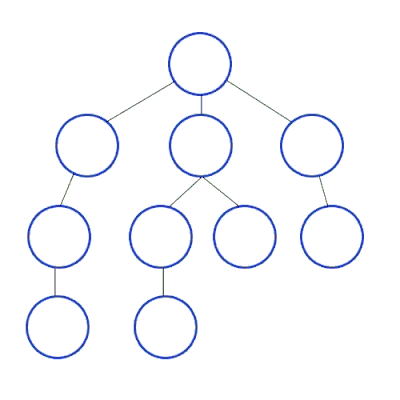

# Breadth-First Search

## Principe

**Breadth-First Search** (**BFS**) ou **Parcours en largeur**, est un algorithme utilisé pour parcourir ou rechercher des données dans un graphe ou un arbre.

L'idée principale est de visiter tout les voisins d'un noeud avant de passer aux voisins des voisins, cela signifie qu'il explore d'abord tous les noeuds à un niveau donnée avant de passer au niveau suivant.

Exemple animé de l'algorithme de parcours en largeur:  

### Facile

| Label                                                                                          | Tags                                                                                                                         | Date       |
| ---------------------------------------------------------------------------------------------- | ---------------------------------------------------------------------------------------------------------------------------- | ---------- |
| [100. Same Tree](../Probleme/0100.%20Same%20Tree/)                                             | [`Tree`](./tree.md), [`Depth-First Search`](./dfs.md), [`Breadth-First Search`](./bfs.md), [`Binary Tree`](./binary_tree.md) | 26-02-2024 |
| [104. Maximum Depth of Binary Tree](../Probleme/0104.%20Maximum%20Depth%20of%20Binary%20Tree/) | [`Tree`](./tree.md), [`Depth-First Search`](./dfs.md), [`Breadth-First Search`](./bfs.md), [`Binary Tree`](./binary_tree.md) | 31-03-2024 |
| [226. Invert Binary Tree](../Probleme/0226.%20Invert%20Binary%20Tree/)                         | [`Tree`](./tree.md), [`Depth-First Search`](./dfs.md), [`Breadth-First Search`](./bfs.md), [`Binary Tree`](./binary_tree.md) | 31-03-2024 |
| [404. Sum of Left Leaves](../Probleme/0404.%20Sum%20of%20Left%20Leaves/)                       | [`Tree`](./tree.md), [`Depth-First Search`](./dfs.md), [`Breadth-First Search`](./bfs.md), [`Binary Tree`](./binary_tree.md) | 15-04-2024 |
| [463. Island Perimeter](../Probleme/0463.%20Island%20Perimeter/)                               | [`Array`](./array.md), [`Depth-First Search`](./dfs.md), [`Breadth-First Search`](./bfs.md), [`Matrix`](./matrix.md)         | 27-04-2024 |

### Moyen

| Label                                                                                                   | Tags                                                                                                                                                       | Date       |
| ------------------------------------------------------------------------------------------------------- | ---------------------------------------------------------------------------------------------------------------------------------------------------------- | ---------- |
| [200. Number of Islands](../Probleme/0200.%20Number%20of%20Islands/)                                    | [`Array`](./array.md), [`Depth-First Search`](./dfs.md), [`Breadth-First Search`](./bfs.md), [`Union Find`](./union_find.md), [`Matrix`](./matrix.md)      | 19-04-2024 |
| [513. Find Bottom Left Tree Value](../Probleme/0513.%20Find%20Bottom%20Left%20Tree%20Value/)            | [`Tree`](./tree.md), [`Depth-First Search`](./dfs.md), [`Breadth-First Search`](./bfs.md), [`Binary Tree`](./binary_tree.md)                               | 28-02-2024 |
| [542. 01 Matrix](../Probleme/0542.%2001%20Matrix/)                                                      | [`Array`](./array.md), [`Dynamic Programming`](./dp.md), [`Breadth-First Search`](./bfs.md), [`Matrix`](./matrix.md)                                       | 27-04-2024 |
| [623. Add One Row to Tree](../Probleme/0623.%20Add%20One%20Row%20to%20Tree/)                            | [`Tree`](./tree.md), [`Depth-First Search`](./dfs.md), [`Breadth-First Search`](./bfs.md), [`Binary Tree`](./binary_tree.md)                               | 16-04-2024 |
| [752. Open the Lock](../Probleme/0752.%20Open%20the%20Lock/)                                            | [`Array`](./array.md), [`Hash Table`](./hash_table.md), [`String`](./string.md), [`Breadth-First Search`](./bfs.md)                                        | 22-04-2024 |
| [934. Shortest Bridge](../Probleme/0934.%20Shortest%20Bridge/)                                          | [`Array`](./array.md), [`Depth-First Search`](./dfs.md), [`Breadth-First Search`](./bfs.md), [`Matrix`](./matrix.md)                                       | 29-03-2024 |
| [1609. Even Odd Tree](../Probleme/1609.%20Even%20Odd%20Tree/)                                           | [`Tree`](./tree.md), [`Breadth-First Search`](./bfs.md), [`Binary Tree`](./binary_tree.md)                                                                 | 29-02-2024 |
| [2812. Find the Safest Path in a Grid](../Probleme/2812.%20Find%20the%20Safest%20Path%20in%20a%20Grid/) | [`Array`](./array.md), [`Binary Search`](./binary_search.md), [`Breadth-First Search`](./bfs.md), [`Union Find`](./union_find.md), [`Matrix`](./matrix.md) | 15-05-2024 |

### Difficile

| Label                                                                                         | Tags                                                                                                                                                    | Date       |
| --------------------------------------------------------------------------------------------- | ------------------------------------------------------------------------------------------------------------------------------------------------------- | ---------- |
| [2092. Find All People With Secret](../Probleme/2092.%20Find%20All%20People%20With%20Secret/) | [`Depth-First Search`](./dfs.md), [`Breadth-First Search`](./bfs.md), [`Union Find`](./union_find.md), [`Graph`](./graph.md), [`Sorting`](./sorting.md) | 24-02-2024 |
