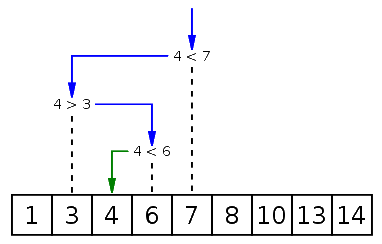

# Binary Search

## Principe

La **Recherche Binaire**, également connue sous le nom de **Recherche Dichotomique**, est un algorithme utilisé pour localiser la position d'un élément dans un tableau trié.

Son fonctionnement est le suivant:

- On imagine le tableau comme une plage avec un début et une fin.
- On examine l'élément situé au milieu de cette plage (généralement en utilisant la formule `(debut + fin) / 2`).
- On réduit ensuite la plage de recherche en fonction de cet élément.

Visualisation d'une recherche dichotomique, où 4 est la valeur recherchée:  

### Facile

| Label                                                                                                                         | Tags                                                                                                                               | Date       |
| ----------------------------------------------------------------------------------------------------------------------------- | ---------------------------------------------------------------------------------------------------------------------------------- | ---------- |
| [35. Search Insert Position](../Probleme/0035.%20Search%20Insert%20Position/)                                                 | [`Array`](./array.md), [`Binary Search`](./binary_search.md)                                                                       | 09-03-2024 |
| [349. Intersection of Two Arrays](../Probleme/0349.%20Intersection%20of%20Two%20Arrays/)                                      | [`Array`](./array.md), [`Hash Table`](./hash_table.md), [`Binary Search`](./binary_search.md), [`Sorting`](./sorting.md)           | 10-03-2024 |
| [704. Binary Search](../Probleme/0704.%20Binary%20Search/)                                                                    | [`Array`](./array.md), [`Binary Search`](./binary_search.md)                                                                       | 09-03-2024 |
| [744. Find Smallest Letter Greater Than Target](../Probleme/0744.%20Find%20Smallest%20Letter%20Greater%20Than%20Target/)      | [`Array`](./array.md), [`Binary Search`](./binary_search.md)                                                                       | 09-03-2024 |
| [1351. Count Negative Numbers in a Sorted Matrix](../Probleme/1351.%20Count%20Negative%20Numbers%20in%20a%20Sorted%20Matrix/) | [`Array`](./array.md), [`Binary Search`](./binary_search.md), [`Matrix`](./matrix.md)                                              | 09-03-2024 |
| [2540. Minimum Common Value](../Probleme/2540.%20Minimum%20Common%20Value/)                                                   | [`Array`](./array.md), [`Hash Table`](./hash_table.md), [`Two Pointers`](./two_pointers.md), [`Binary Search`](./binary_search.md) | 09-03-2024 |

### Moyen

| Label | Tags | Date |
| ----- | ---- | ---- |

### Difficile

| Label                                                                                      | Tags                                                                                                          | Date       |
| ------------------------------------------------------------------------------------------ | ------------------------------------------------------------------------------------------------------------- | ---------- |
| [4. Median of Two Sorted Arrays](../Probleme/0004.%20Median%20of%20Two%20Sorted%20Arrays/) | [`Array`](./array.md), [`Binary Search`](./binary_search.md), [`Divide and Conquer`](./divide_and_conquer.md) | 19-02-2024 |
