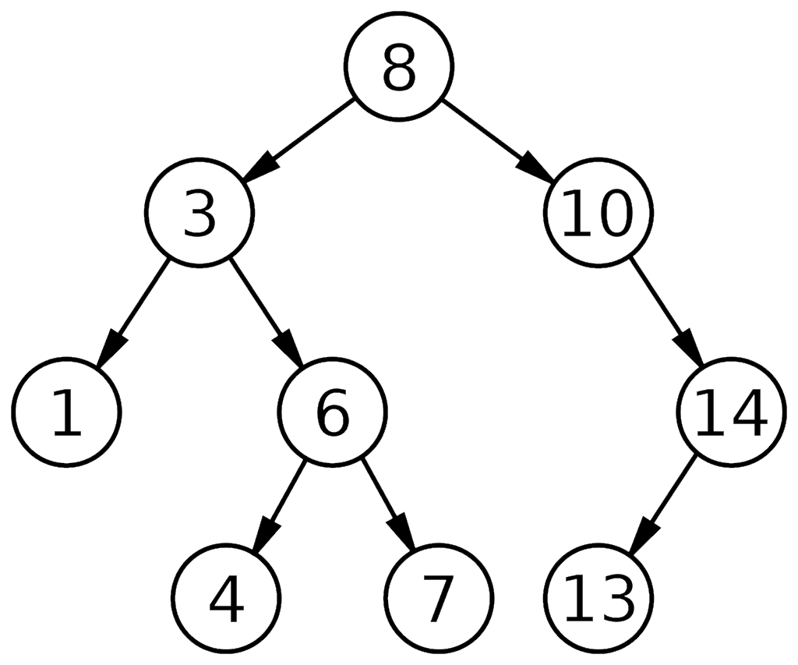

# Binary Search Tree

## Principe

Un **Binary Search Tree (BST)** ou un **Arbre Binaire de Recherche (ABR)** est une structure de données qui organise des éléments de manière hiérarchique.

Chaque élément a au plus deux enfants, les éléments appartenant au sous-arbre gauche sont inférieurs et les éléments du sous-arbre droit sont supérieurs.

Cette disposition permet de rechercher, insérer et supprimer efficacement des éléments dans l'arbre.

Les 3 opérations principales ont une complexité temporelle de `O(log n)` en moyenne et dans le pire des cas `O(n)`.

Exemple d'un arbre binaire de recherche:  

### Facile

| Label                                                                                                  | Tags                                                                                                                                                                                            | Date       |
| ------------------------------------------------------------------------------------------------------ | ----------------------------------------------------------------------------------------------------------------------------------------------------------------------------------------------- | ---------- |
| [703. Kth Largest Element in a Stream](../Probleme/0703.%20Kth%20Largest%20Element%20in%20a%20Stream/) | [`Tree`](./tree.md), [`Design`](./design.md), [`Binary Search Tree`](./binary_search_tree.md), [`Heap (Priority Queue)`](./priority_queue.md), [`Binary Tree`](./binary_tree.md), `Data Stream` | 27-04-2024 |

### Moyen

| Label                                                                                                                   | Tags                                                                                                                                      | Date       |
| ----------------------------------------------------------------------------------------------------------------------- | ----------------------------------------------------------------------------------------------------------------------------------------- | ---------- |
| [1038. Binary Search Tree to Greater Sum Tree](../Probleme/1038.%20Binary%20Search%20Tree%20to%20Greater%20Sum%20Tree/) | [`Tree`](./tree.md), [`Depth-First Search`](./dfs.md), [`Binary Search Tree`](./binary_search_tree.md), [`Binary Tree`](./binary_tree.md) | 25-06-2024 |

### Difficile

| Label | Tags | Date |
| ----- | ---- | ---- |
