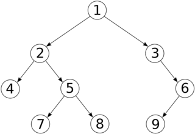

# Binary Tree

## Principe

Un arbre binaire est une structure de données composée de noeuds. Chaque noeud peut avoir au plus deux enfants, appelés noeuds gauche et droit. Ces noeuds sont organisés de manière hiérarchique, avec un noeud spécial appelé racine à partir duquel tout commence.
Les noeuds sans enfant sont appelés feuilles. Les arbres binaires sont largement utilisés en informatique pour représenter et organiser des données de manière efficace.

Un exemple simple d'arbre binaire:  

### Facile

| Label                                                                     | Tags                                                                                                                                                     | Date       |
| ------------------------------------------------------------------------- | -------------------------------------------------------------------------------------------------------------------------------------------------------- | ---------- |
| [100. Same Tree](../0100.%20Same%20Tree/)                                 | [`Tree`](./skills/tree.md), [`Depth-First Search`](./skills/dfs.md), [`Breadth-First Search`](./skills/bfs.md), [`Binary Tree`](./skills/binary_tree.md) | 26-02-2024 |
| [543. Diameter of Binary Tree](../0543.%20Diameter%20of%20Binary%20Tree/) | [`Tree`](./skills/tree.md), [`Depth-First Search`](./skills/dfs.md), [`Binary Tree`](./skills/binary_tree.md)                                            | 27-02-2024 |

### Moyen

| Label                                                                               | Tags                                                                                                                                                     | Date       |
| ----------------------------------------------------------------------------------- | -------------------------------------------------------------------------------------------------------------------------------------------------------- | ---------- |
| [513. Find Bottom Left Tree Value](../0513.%20Find%20Bottom%20Left%20Tree%20Value/) | [`Tree`](./skills/tree.md), [`Depth-First Search`](./skills/dfs.md), [`Breadth-First Search`](./skills/bfs.md), [`Binary Tree`](./skills/binary_tree.md) | 28-02-2024 |
| [1609. Even Odd Tree](../1609.%20Even%20Odd%20Tree/)                                | [`Tree`](./skills/tree.md), [`Breadth-First Search`](./skills/bfs.md), [`Binary Tree`](./skills/binary_tree.md)                                          |

### Difficile

| Label | Tags | Date |
| ----- | ---- | ---- |
