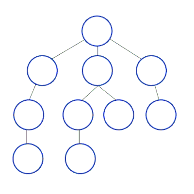

# Depth-First Search

## Principe

**Depth-First Search** (**DFS**) ou **Parcours en profondeur**, est un algorithme utilisé pour parcourir ou rechercher des données dans un graphe ou un arbre.

L'idée principale est de visiter le plus profondément possible le long d'une branche avant de revenir en arrière pour explorer d'autres branches.

Exemple animé de l'algorithme de parcours en profondeur:  

### Facile

| Label                                                                                          | Tags                                                                                                                         | Date       |
| ---------------------------------------------------------------------------------------------- | ---------------------------------------------------------------------------------------------------------------------------- | ---------- |
| [100. Same Tree](../Probleme/0100.%20Same%20Tree/)                                             | [`Tree`](./tree.md), [`Depth-First Search`](./dfs.md), [`Breadth-First Search`](./bfs.md), [`Binary Tree`](./binary_tree.md) | 26-02-2024 |
| [104. Maximum Depth of Binary Tree](../Probleme/0104.%20Maximum%20Depth%20of%20Binary%20Tree/) | [`Tree`](./tree.md), [`Depth-First Search`](./dfs.md), [`Breadth-First Search`](./bfs.md), [`Binary Tree`](./binary_tree.md) | 31-03-2024 |
| [226. Invert Binary Tree](../Probleme/0226.%20Invert%20Binary%20Tree/)                         | [`Tree`](./tree.md), [`Depth-First Search`](./dfs.md), [`Breadth-First Search`](./bfs.md), [`Binary Tree`](./binary_tree.md) | 31-03-2024 |
| [543. Diameter of Binary Tree](../Probleme/0543.%20Diameter%20of%20Binary%20Tree/)             | [`Tree`](./tree.md), [`Depth-First Search`](./dfs.md), [`Binary Tree`](./binary_tree.md)                                     | 27-02-2024 |

### Moyen

| Label                                                                                        | Tags                                                                                                                         | Date       |
| -------------------------------------------------------------------------------------------- | ---------------------------------------------------------------------------------------------------------------------------- | ---------- |
| [513. Find Bottom Left Tree Value](../Probleme/0513.%20Find%20Bottom%20Left%20Tree%20Value/) | [`Tree`](./tree.md), [`Depth-First Search`](./dfs.md), [`Breadth-First Search`](./bfs.md), [`Binary Tree`](./binary_tree.md) | 28-02-2024 |

### Difficile

| Label                                                                                         | Tags                                                                                                                                                    | Date       |
| --------------------------------------------------------------------------------------------- | ------------------------------------------------------------------------------------------------------------------------------------------------------- | ---------- |
| [2092. Find All People With Secret](../Probleme/2092.%20Find%20All%20People%20With%20Secret/) | [`Depth-First Search`](./dfs.md), [`Breadth-First Search`](./bfs.md), [`Union Find`](./union_find.md), [`Graph`](./graph.md), [`Sorting`](./sorting.md) | 24-02-2024 |
