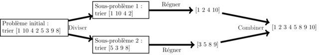

# Divide and Conquer

## Principe

Divide and Conquer ou "Diviser pour régner" est une technique algorithmique où un problème complexe est divisé en problèmes plus petits et plus simples à résoudre. Ensuite, les solutions des sous-problèmes sont combinées pour obtenir la solution du problème complexe. Cette approche permet souvent de résoudre des problèmes difficiles de manière plus efficace en les décomposant en parties gérables.

Trois étapes (diviser, régner, combiner) illustrées avec l'algorithme du tri fusion:  

### Facile

| Label | Tags | Date |
| ----- | ---- | ---- |

### Moyen

| Label | Tags | Date |
| ----- | ---- | ---- |

### Difficile

| Label                                                                             | Tags                                                                                                          | Date       |
| --------------------------------------------------------------------------------- | ------------------------------------------------------------------------------------------------------------- | ---------- |
| [4. Median of Two Sorted Arrays](../0004.%20Median%20of%20Two%20Sorted%20Arrays/) | [`Array`](./array.md), [`Binary Search`](./binary_search.md), [`Divide and Conquer`](./divide_and_conquer.md) | 19-02-2024 |
