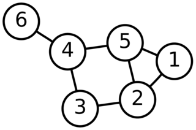

# Graph

Un graphe est une structure de données qui représente des relations entre des objets. Il est composé de noeuds (ou sommets) qui représentent des entités, et des arêtes qui symbolisant les connexions entre ces entités. Les graphes servent à modéliser divers problèmes comme les réseaux sociaux, les itinéraires, les circuits électroniques, ect.

Illustration d'un graphe:  

## Principe

### Facile

| Label                                                             | Tags                                                                          | Date       |
| ----------------------------------------------------------------- | ----------------------------------------------------------------------------- | ---------- |
| [997. Find the Town Judge](../0997.%20Find%20the%20Town%20Judge/) | [`Array`](./array.md), [`Hash Table`](./hash_table.md), [`Graph`](./graph.md) | 22-02-2024 |

### Moyen

| Label | Tags | Date |
| ----- | ---- | ---- |

### Difficile

| Label                                                                                | Tags                                                                                                                                                    | Date       |
| ------------------------------------------------------------------------------------ | ------------------------------------------------------------------------------------------------------------------------------------------------------- | ---------- |
| [2092. Find All People With Secret](../2092.%20Find%20All%20People%20With%20Secret/) | [`Depth-First Search`](./dfs.md), [`Breadth-First Search`](./bfs.md), [`Union Find`](./union_find.md), [`Graph`](./graph.md), [`Sorting`](./sorting.md) | 24-02-2024 |
