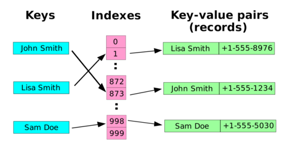

# Hash Table

## Principe

Une **Table de Hachage** une structure de données qui permet une association clé-valeur. Son but principal est de permettre de retrouver une clé donnée très rapidement, en la cherchant à un emplacement de la table correspondant au résultat d'une fonction de hachage calculée en O(1). Cela constitue un gain de temps très important pour les grosses tables, lors d'une recherche ou d'un besoin d'accès aux données en utilisant la clé définie.

Un annuaire représenté comme une table de hachage. La fonction de hachage transforme les clés en valeurs de hachage indexant les éléments de la table composés de paires clé-valeur:  

### Facile

| Label                                                                                                                                    | Tags                                                                                                                                | Date       |
| ---------------------------------------------------------------------------------------------------------------------------------------- | ----------------------------------------------------------------------------------------------------------------------------------- | ---------- |
| [1. Two Sum](../0001.%20Two%20Sum/)                                                                                                      | [`Array`](./array.md), [`Hash Table`](./hash_table.md)                                                                              | 18-02-2024 |
| [141. Linked List Cycle](../0141.%20Linked%20List%20Cycle/)                                                                              | [`Hash Table`](./hash_table.md), [`Linked List`](./linked_list.md), [`Two Pointers`](./two_pointers.md)                             | 06-03-2024 |
| [349. Intersection of Two Arrays](../0349.%20Intersection%20of%20Two%20Arrays/)                                                          | [`Array`](./array.md), [`Hash Table`](./hash_table.md), [`Binary Search`](./binary_search.md), [`Sorting`](./sorting.md)            | 10-03-2024 |
| [706. Design HashMap](../0706.%20Design%20HashMap/)                                                                                      | [`Array`](./array.md), [`Hash Table`](./hash_table.md), [`Linked List`](./linked_list.md), [`Design`](./design.md), `Hash Function` | 09-03-2024 |
| [997. Find the Town Judge](../0997.%20Find%20the%20Town%20Judge/)                                                                        | [`Array`](./array.md), [`Hash Table`](./hash_table.md), [`Graph`](./graph.md)                                                       | 22-02-2024 |
| [1893. Check if All the Integers in a Range Are Covered](../1893.%20Check%20if%20All%20the%20Integers%20in%20a%20Range%20Are%20Covered/) | [`Array`](./array.md), [`Prefix Sum`](./prefix_sum.md), `Counting`                                                                  | 26-02-2024 |
| [2540. Minimum Common Value](../2540.%20Minimum%20Common%20Value/)                                                                       | [`Array`](./array.md), [`Hash Table`](./hash_table.md), [`Two Pointers`](./two_pointers.md), [`Binary Search`](./binary_search.md)  | 09-03-2024 |
| [3005. Count Elements With Maximum Frequency](../3005.%20Count%20Elements%20With%20Maximum%20Frequency/)                                 | [`Array`](./array.md), [`Hash Table`](./hash_table.md), `Counting`                                                                  | 08-03-2024 |

### Moyen

| Label                                                                                                                   | Tags                                                                                              | Date       |
| ----------------------------------------------------------------------------------------------------------------------- | ------------------------------------------------------------------------------------------------- | ---------- |
| [3. Longest Substring Without Repeating Characters](../0003.%20Longest%20Substring%20Without%20Repeating%20Characters/) | [`String`](./string.md), [`Hash Table`](./hash_table.md), [`Sliding Window`](./sliding_window.md) | 18-02-2024 |

### Difficile

| Label | Tags | Date |
| ----- | ---- | ---- |
