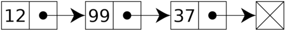

# Linked List

## Principe

**Linked List** ou **Liste Chaînée** est une structure de données, où chaque élément, appelé noeud, contient une valeur et une référence (ou un pointeur) vers le prochain élément dans la liste. Cela permet de créer une séquence d'éléments connectés, où chaque élément peut être accédé en suivant les références à partir du premier élément, appelé tête de liste.

Une liste chaînée, composée de trois éléments ayant respectivement la valeur : 12, 99 et 37:  

### Facile

| Label                                                                                                                                             | Tags                                                                                                                                | Date       |
| ------------------------------------------------------------------------------------------------------------------------------------------------- | ----------------------------------------------------------------------------------------------------------------------------------- | ---------- |
| [21. Merge Two Sorted Lists](../Probleme/0021.%20Merge%20Two%20Sorted%20Lists/)                                                                   | [`Linked List`](./linked_list.md), [`Recursion`](./recursion.md)                                                                    | 15-03-2024 |
| [83. Remove Duplicates from Sorted List](../Probleme/0083.%20Remove%20Duplicates%20from%20Sorted%20List/)                                         | [`Linked List`](./linked_list.md)                                                                                                   | 15-03-2024 |
| [141. Linked List Cycle](../Probleme/0141.%20Linked%20List%20Cycle/)                                                                              | [`Hash Table`](./hash_table.md), [`Linked List`](./linked_list.md), [`Two Pointers`](./two_pointers.md)                             | 06-03-2024 |
| [206. Reverse Linked List](../Probleme/0206.%20Reverse%20Linked%20List/)                                                                          | [`Linked List`](./linked_list.md), [`Recursion`](./recursion.md)                                                                    | 09-03-2024 |
| [234. Palindrome Linked List](../Probleme/0234.%20Palindrome%20Linked%20List/)                                                                    | [`Linked List`](./linked_list.md), [`Two Pointers`](./two_pointers.md), [`Stack`](./stack.md), [`Recursion`](./recursion.md)        | 22-03-2024 |
| [706. Design HashMap](../Probleme/0706.%20Design%20HashMap/)                                                                                      | [`Array`](./array.md), [`Hash Table`](./hash_table.md), [`Linked List`](./linked_list.md), [`Design`](./design.md), `Hash Function` | 09-03-2024 |
| [876. Middle of the Linked List](../Probleme/0876.%20Middle%20of%20the%20Linked%20List/)                                                          | [`Linked List`](./linked_list.md), [`Two Pointers`](./two_pointers.md)                                                              | 07-03-2024 |
| [1290. Convert Binary Number in a Linked List to Integer](../Probleme/1290.%20Convert%20Binary%20Number%20in%20a%20Linked%20List%20to%20Integer/) | [`Linked List`](./linked_list.md), [`Math`](./math.md)                                                                              | 15-03-2024 |

### Moyen

| Label                                                                                                     | Tags                                                                                  | Date       |
| --------------------------------------------------------------------------------------------------------- | ------------------------------------------------------------------------------------- | ---------- |
| [2. Add Two Numbers](../Probleme/0002.%20Add%20Two%20Numbers/)                                            | [`Linked List`](./linked_list.md), [`Math`](./math.md), [`Recursion`](./recursion.md) | 18-02-2024 |
| [19. Remove Nth Node From End of List](../Probleme/0019.%20Remove%20Nth%20Node%20From%20End%20of%20List/) | [`Linked List`](./linked_list.md), [`Two Pointers`](./two_pointers.md)                | 03-03-2024 |
| [1669. Merge In Between Linked Lists](../Probleme/1669.%20Merge%20In%20Between%20Linked%20Lists/)         | [`Linked List`](./linked_list.md)                                                     | 20-03-2024 |

### Difficile

| Label | Tags | Date |
| ----- | ---- | ---- |
