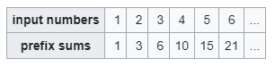

# Prefix Sum

## Principe

Le principe de **Prefix Sum** consiste à calculer la somme cumulative des éléments d'un tableau, où chaque élément de sortie est la somme des éléments précédents jusqu'à une position donnée dans le tableau d'entrée. En d'autres termes, vous ajoutez progressivement les éléments du tableau depuis le début jusqu'à une position donnée pour obtenir la somme cumulée jusqu'à cette position. Cela permet d'accélérer les calculs de sommes partielles lorsqu'on doit les répéter plusieurs fois.

### Facile

| Label                                                                                                                                             | Tags                                                                                    | Date       |
| ------------------------------------------------------------------------------------------------------------------------------------------------- | --------------------------------------------------------------------------------------- | ---------- |
| [303. Range Sum Query - Immutable](../Probleme/0303.%20Range%20Sum%20Query%20-%20Immutable/)                                                      | [`Array`](./array.md), [`Design`](./design.md), [`Prefix Sum`](./prefix_sum.md)         | 26-02-2024 |
| [724. Find Pivot Index](../Probleme/0724.%20Find%20Pivot%20Index/)                                                                                | [`Array`](./array.md), [`Prefix Sum`](./prefix_sum.md)                                  | 26-02-2024 |
| [1413. Minimum Value to Get Positive Step by Step Sum](../Probleme/1413.%20Minimum%20Value%20to%20Get%20Positive%20Step%20by%20Step%20Sum/)       | [`Array`](./array.md), [`Prefix Sum`](./prefix_sum.md)                                  | 27-02-2024 |
| [1422. Maximum Score After Splitting a String](../Probleme/1422.%20Maximum%20Score%20After%20Splitting%20a%20String/)                             | [`String`](./string.md), [`Prefix Sum`](./prefix_sum.md)                                | 27-02-2024 |
| [1480. Running Sum of 1d Array](../Probleme/1480.%20Running%20Sum%20of%201d%20Array/)                                                             | [`Array`](./array.md), [`Prefix Sum`](./prefix_sum.md)                                  | 27-02-2024 |
| [1588. Sum of All Odd Length Subarrays](../Probleme/1588.%20Sum%20of%20All%20Odd%20Length%20Subarrays/)                                           | [`Array`](./array.md), [`Prefix Sum`](./prefix_sum.md), [`Math`](./math.md)             | 27-02-2024 |
| [1732. Find the Highest Altitude](../Probleme/1732.%20Find%20the%20Highest%20Altitude/)                                                           | [`Array`](./array.md), [`Prefix Sum`](./prefix_sum.md)                                  | 28-02-2024 |
| [1854. Maximum Population Year](../Probleme/1854.%20Maximum%20Population%20Year/)                                                                 | [`Array`](./array.md), [`Prefix Sum`](./prefix_sum.md), [`Counting`](./counting.md)     | 26-02-2024 |
| [1893. Check if All the Integers in a Range Are Covered](../Probleme/1893.%20Check%20if%20All%20the%20Integers%20in%20a%20Range%20Are%20Covered/) | [`Array`](./array.md), [`Prefix Sum`](./prefix_sum.md), [`Counting`](./counting.md)     | 26-02-2024 |
| [1991. Find the Middle Index in Array](../Probleme/1991.%20Find%20the%20Middle%20Index%20in%20Array/)                                             | [`Array`](./array.md), [`Prefix Sum`](./prefix_sum.md)                                  | 26-02-2024 |
| [2485. Find the Pivot Integer](../Probleme/2485.%20Find%20the%20Pivot%20Integer/)                                                                 | [`Prefix Sum`](./prefix_sum.md), [`Math`](./math.md)                                    | 13-03-2024 |
| [3028. Ant on the Boundary](../Probleme/3028.%20Ant%20on%20the%20Boundary/)                                                                       | [`Array`](./array.md), [`Prefix Sum`](./prefix_sum.md), [`Simulation`](./simulation.md) | 26-02-2024 |

### Moyen

| Label                                                                                          | Tags                                                   | Date       |
| ---------------------------------------------------------------------------------------------- | ------------------------------------------------------ | ---------- |
| [238. Product of Array Except Self](../Probleme/0238.%20Product%20of%20Array%20Except%20Self/) | [`Array`](./array.md), [`Prefix Sum`](./prefix_sum.md) | 22-02-2024 |

### Difficile

| Label | Tags | Date |
| ----- | ---- | ---- |
