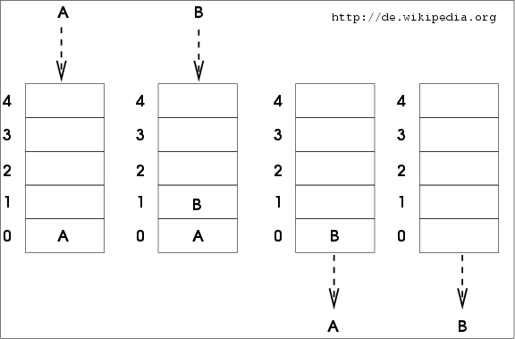

# Queue

## Principe

Une **Queue** ou une **File** est une structure de données fondée sur le principe "Premier arrivé, premier sorti" (FIFO pour "First In, First Out").

Illustration de l'utilisation d'une file:  

### Facile

| Label                                                                                        | Tags                                                                  | Date       |
| -------------------------------------------------------------------------------------------- | --------------------------------------------------------------------- | ---------- |
| [225. Implement Stack using Queues](../Probleme/0225.%20Implement%20Stack%20using%20Queues/) | [`Stack`](./stack.md), [`Design`](./design.md), [`Queue`](./queue.md) | 15-03-2024 |

### Moyen

| Label                                                                                                                                                                                                     | Tags                                                                                                                                                                                                                | Date       |
| --------------------------------------------------------------------------------------------------------------------------------------------------------------------------------------------------------- | ------------------------------------------------------------------------------------------------------------------------------------------------------------------------------------------------------------------- | ---------- |
| [649. Dota2 Senate](../Probleme/0649.%20Dota2%20Senate/)                                                                                                                                                  | [`String`](./string.md), [`Greedy`](./greedy.md), [`Queue`](./queue.md)                                                                                                                                             | 18-04-2024 |
| [1438. Longest Continuous Subarray With Absolute Diff Less Than or Equal to Limit](../Probleme/1438.%20Longest%20Continuous%20Subarray%20With%20Absolute%20Diff%20Less%20Than%20or%20Equal%20to%20Limit/) | [`Array`](./array.md), [`Queue`](./queue.md), [`Sliding Window`](./sliding_window.md), [`Heap (Priority Queue)`](./priority_queue.md), [`Ordered Set`](./ordered_set.md), [`Monotonic Queue`](./monotonic_queue.md) | 23-06-2024 |
| [1823. Find the Winner of the Circular Game](../Probleme/1823.%20Find%20the%20Winner%20of%20the%20Circular%20Game/)                                                                                       | [`Array`](./array.md), [`Math`](./math.md), [`Recursion`](./recursion.md), [`Queue`](./queue.md), [`Simulation`](./simulation.md)                                                                                   | 09-07-2024 |

### Difficile

| Label | Tags | Date |
| ----- | ---- | ---- |
