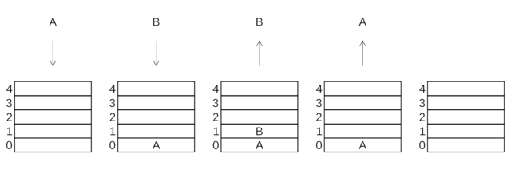

# Stack

## Principe

Un **Stack** ou une **Pile** est une structure de données fondée sur le principe "Dernier arrivé, premier sorti" (LIFO pour "Last In, First Out").

Illustration de l'utilisation d'une pile:  

### Facile

| Label                                                                                        | Tags                                                                                                                         | Date       |
| -------------------------------------------------------------------------------------------- | ---------------------------------------------------------------------------------------------------------------------------- | ---------- |
| [20. Valid Parentheses](../Probleme/0020.%20Valid%20Parentheses/)                            | [`String`](./string.md), [`Stack`](./stack.md)                                                                               | 25-03-2024 |
| [225. Implement Stack using Queues](../Probleme/0225.%20Implement%20Stack%20using%20Queues/) | [`Stack`](./stack.md), [`Design`](./design.md), [`Queue`](./queue.md)                                                        | 15-03-2024 |
| [234. Palindrome Linked List](../Probleme/0234.%20Palindrome%20Linked%20List/)               | [`Linked List`](./linked_list.md), [`Two Pointers`](./two_pointers.md), [`Stack`](./stack.md), [`Recursion`](./recursion.md) | 22-03-2024 |

### Moyen

| Label                                                                                                                                 | Tags                                                                                                                               | Date       |
| ------------------------------------------------------------------------------------------------------------------------------------- | ---------------------------------------------------------------------------------------------------------------------------------- | ---------- |
| [143. Reorder List](../Probleme/0143.%20Reorder%20List/)                                                                              | [`Linked List`](./linked_list.md), [`Two Pointers`](./two_pointers.md), [`Stack`](./stack.md), [`Recursion`](./recursion.md)       | 23-03-2024 |
| [155. Min Stack](../Probleme/0155.%20Min%20Stack/)                                                                                    | [`Stack`](./stack.md), [`Design`](./design.md)                                                                                     | 11-03-2024 |
| [2390. Removing Stars From a String](../Probleme/2390.%20Removing%20Stars%20From%20a%20String/)                                       | [`String`](./string.md), [`Stack`](./stack.md), [`Simulation`](./simulation.md)                                                    | 15-03-2024 |
| [2487. Remove Nodes From Linked List](../Probleme/2487.%20Remove%20Nodes%20From%20Linked%20List/)                                     | [`Linked List`](./linked_list.md), [`Stack`](./stack.md), [`Recursion`](./recursion.md), [`Monotonic Stack`](./monotonic_stack.md) | 06-05-2024 |
| [2816. Double a Number Represented as a Linked List](../Probleme/2816.%20Double%20a%20Number%20Represented%20as%20a%20Linked%20List/) | [`Linked List`](./linked_list.md), [`Math`](./math.md), [`Stack`](./stack.md)                                                      | 04-07-2024 |

### Difficile

| Label                                                                               | Tags                                                                                                                                   | Date       |
| ----------------------------------------------------------------------------------- | -------------------------------------------------------------------------------------------------------------------------------------- | ---------- |
| [32. Longest Valid Parentheses](../Probleme/0032.%20Longest%20Valid%20Parentheses/) | [`String`](./string.md), [`Dynamic Programming`](./dp.md), [`Stack`](./stack.md)                                                       | 27-04-2024 |
| [42. Trapping Rain Water](../Probleme/0042.%20Trapping%20Rain%20Water/)             | [`Array`](./array.md), [`Two Pointers`](./two_pointers.md), [`Dynamic Programming`](./dp.md), [`Stack`](./stack.md), `Monotonic Stack` | 20-05-2024 |
