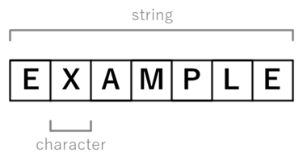

# String

## Principe

Un string, également appelé chaîne de caractères, est un type de donnée qui représente une série ordonnée de caractères.

Illustration d'une chaîne de caractères:  

### Facile

| Label                                                                                                                 | Tags                                                                                                                       | Date       |
| --------------------------------------------------------------------------------------------------------------------- | -------------------------------------------------------------------------------------------------------------------------- | ---------- |
| [13. Roman to Integer](../Probleme/0013.%20Roman%20to%20Integer/)                                                     | [`Hash Table`](./hash_table.md), [`Math`](./math.md), [`String`](./string.md)                                              | 14-03-2024 |
| [67. Add Binary](../Probleme/0067.%20Add%20Binary/)                                                                   | [`Math`](./math.md), [`String`](./string.md), [`Bit Manipulation`](./bit_manipulation.md), [`Simulation`](./simulation.md) | 04-03-2024 |
| [345. Reverse Vowels of a String](../Probleme/0345.%20Reverse%20Vowels%20of%20a%20String/)                            | [`String`](./string.md), [`Two Pointers`](./two_pointers.md)                                                               | 20-02-2024 |
| [392. Is Subsequence](../Probleme/0392.%20Is%20Subsequence/)                                                          | [`String`](./string.md), [`Two Pointers`](./two_pointers.md), [`Dynamic Programming`](./dp.md)                             | 08-03-2024 |
| [415. Add Strings](../Probleme/0415.%20Add%20Strings/)                                                                | [`Math`](./math.md), [`String`](./string.md), [`Simulation`](./simulation.md)                                              | 09-03-2024 |
| [1071. Greatest Common Divisor of Strings](../Probleme/1071.%20Greatest%20Common%20Divisor%20of%20Strings/)           | [`Math`](./math.md), [`String`](./string.md)                                                                               | 20-02-2024 |
| [1422. Maximum Score After Splitting a String](../Probleme/1422.%20Maximum%20Score%20After%20Splitting%20a%20String/) | [`String`](./string.md), [`Prefix Sum`](./prefix_sum.md)                                                                   | 27-02-2024 |
| [1768. Merge Strings Alternately](../Probleme/1768.%20Merge%20Strings%20Alternately/)                                 | [`String`](./string.md), [`Two Pointers`](./two_pointers.md)                                                               | 20-02-2024 |
| [2864. Maximum Odd Binary Number](../Probleme/2864.%20Maximum%20Odd%20Binary%20Number/)                               | [`Math`](./math.md), [`String`](./string.md), [`Greedy`](./greedy.md)                                                      | 01-03-2024 |

### Moyen

| Label                                                                                                                                                           | Tags                                                                                                                                                                                      | Date       |
| --------------------------------------------------------------------------------------------------------------------------------------------------------------- | ----------------------------------------------------------------------------------------------------------------------------------------------------------------------------------------- | ---------- |
| [3. Longest Substring Without Repeating Characters](../Probleme/0003.%20Longest%20Substring%20Without%20Repeating%20Characters/)                                | [`String`](./string.md), [`Hash Table`](./hash_table.md), [`Sliding Window`](./sliding_window.md)                                                                                         | 18-02-2024 |
| [5. Longest Palindromic Substring](../Probleme/0005.%20Longest%20Palindromic%20Substring/)                                                                      | [`String`](./string.md), [`Dynamic Programming`](./dp.md)                                                                                                                                 | 01-03-2024 |
| [6. Zigzag Conversion](../Probleme/0006.%20Zigzag%20Conversion/)                                                                                                | [`String`](./string.md)                                                                                                                                                                   | 03-03-2024 |
| [8. String to Integer (atoi)](<../Probleme/0008.%20String%20to%20Integer%20(atoi)/>)                                                                            | [`String`](./string.md)                                                                                                                                                                   | 05-03-2024 |
| [12. Integer to Roman](../Probleme/0012.%20Integer%20to%20Roman/)                                                                                               | [`Hash Table`](./hash_table.md), [`Math`](./math.md), [`String`](./string.md)                                                                                                             | 13-03-2024 |
| [17. Letter Combinations of a Phone Number](../Probleme/0017.%20Letter%20Combinations%20of%20a%20Phone%20Number/)                                               | [`Hash Table`](./hash_table.md), [`String`](./string.md), [`Backtracking`](./backtracking.md)                                                                                             | 14-03-2024 |
| [151. Reverse Words in a String](../Probleme/0151.%20Reverse%20Words%20in%20a%20String/)                                                                        | [`String`](./string.md), [`Two Pointers`](./two_pointers.md)                                                                                                                              | 12-03-2024 |
| [443. String Compression](../Probleme/0443.%20String%20Compression/)                                                                                            | [`String`](./string.md), [`Two Pointers`](./two_pointers.md)                                                                                                                              | 12-03-2024 |
| [791. Custom Sort String](../Probleme/0791.%20Custom%20Sort%20String/)                                                                                          | [`Hash Table`](./hash_table.md), [`String`](./string.md), [`Sorting`](./sorting.md)                                                                                                       | 11-03-2024 |
| [1456. Maximum Number of Vowels in a Substring of Given Length](../Probleme/1456.%20Maximum%20Number%20of%20Vowels%20in%20a%20Substring%20of%20Given%20Length/) | [`String`](./string.md), [`Sliding Window`](./sliding_window.md)                                                                                                                          | 13-03-2024 |
| [1750. Minimum Length of String After Deleting Similar Ends](../Probleme/1750.%20Minimum%20Length%20of%20String%20After%20Deleting%20Similar%20Ends/)           | [`String`](./string.md), [`Two Pointers`](./two_pointers.md)                                                                                                                              | 05-03-2024 |
| [2390. Removing Stars From a String](../Probleme/2390.%20Removing%20Stars%20From%20a%20String/)                                                                 | [`String`](./string.md), [`Stack`](./stack.md), [`Simulation`](./simulation.md)                                                                                                           | 15-03-2024 |
| [3081. Replace Question Marks in String to Minimize Its Value](../Probleme/3081.%20Replace%20Question%20Marks%20in%20String%20to%20Minimize%20Its%20Value/)     | [`Hash Table`](./hash_table.md), [`String`](./string.md), [`Greedy`](./greedy.md), [`Sorting`](./sorting.md), [`Heap (Priority Queue)`](./priority_queue.md), [`Counting`](./counting.md) | 22-03-2024 |

### Difficile

| Label                                                                                   | Tags                                                                                     | Date       |
| --------------------------------------------------------------------------------------- | ---------------------------------------------------------------------------------------- | ---------- |
| [10. Regular Expression Matching](../Probleme/0010.%20Regular%20Expression%20Matching/) | [`String`](./string.md), [`Dynamic Programming`](./dp.md), [`Recursion`](./recursion.md) | 05-03-2024 |
