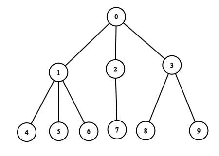

# Tree

## Principe

Un **Tree** ou **Arbre** est une structure de données composée de noeuds. Chaque noeud peut avoir zero ou plusieurs noeuds enfants. Ces noeuds sont organisés de manière hiérarchique, avec un noeud spécial appelé racine à partir duquel tout commence.
Les noeuds terminaux, sans enfants, sont appelés feuilles. Les arbres sont utilisés pour organiser et représenter des données de manière efficace, comme les structures de dossiers dans un système de fichiers ou les relations entre les éléments dans une base de données.

Illustration d'un arbre:  

### Facile

| Label                                                                              | Tags                                                                                                                         | Date       |
| ---------------------------------------------------------------------------------- | ---------------------------------------------------------------------------------------------------------------------------- | ---------- |
| [100. Same Tree](../Probleme/0100.%20Same%20Tree/)                                 | [`Tree`](./tree.md), [`Depth-First Search`](./dfs.md), [`Breadth-First Search`](./bfs.md), [`Binary Tree`](./binary_tree.md) | 26-02-2024 |
| [543. Diameter of Binary Tree](../Probleme/0543.%20Diameter%20of%20Binary%20Tree/) | [`Tree`](./tree.md), [`Depth-First Search`](./dfs.md), [`Binary Tree`](./binary_tree.md)                                     | 27-02-2024 |

### Moyen

| Label                                                                                        | Tags                                                                                                                         | Date       |
| -------------------------------------------------------------------------------------------- | ---------------------------------------------------------------------------------------------------------------------------- | ---------- |
| [513. Find Bottom Left Tree Value](../Probleme/0513.%20Find%20Bottom%20Left%20Tree%20Value/) | [`Tree`](./tree.md), [`Depth-First Search`](./dfs.md), [`Breadth-First Search`](./bfs.md), [`Binary Tree`](./binary_tree.md) | 28-02-2024 |
| [1609. Even Odd Tree](../Probleme/1609.%20Even%20Odd%20Tree/)                                | [`Tree`](./tree.md), [`Breadth-First Search`](./bfs.md), [`Binary Tree`](./binary_tree.md)                                   | 29-02-2024 |

### Difficile

| Label | Tags | Date |
| ----- | ---- | ---- |
