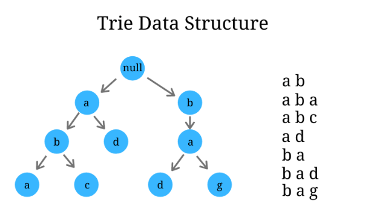

# Trie

## Principe

Un **Trie** ou **Arbre de préfixe**, est une structure de données utilisée pour stocker un ensemble de mots ou de chaînes de caractères de manière efficace.

Chaque noeud de l'arbre représente un caractère, et les chemins de la racine aux noeuds terminaux forment les mots complets

Cette structure est souvent utilisée pour la recherche de mots, la complétion automatique et d'autres opérations sur les chaînes de caractères.

En bref, un Trie est un moyen efficace d'organiser et de rechercher des mots ou des chaînes de caractères en utilisant leurs préfixes communs.

Illustration d'un Trie:  

### Facile

| Label                                                                       | Tags                                         | Date       |
| --------------------------------------------------------------------------- | -------------------------------------------- | ---------- |
| [14. Longest Common Prefix](../Probleme/0014.%20Longest%20Common%20Prefix/) | [`String`](./string.md), [`Trie`](./trie.md) | 25-03-2024 |

### Moyen

| Label | Tags | Date |
| ----- | ---- | ---- |

### Difficile

| Label | Tags | Date |
| ----- | ---- | ---- |
