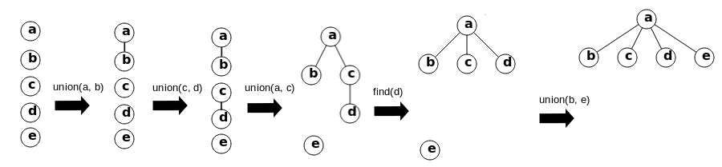

# Union Find

## Principe

**Union Find** est une structure de données utilisée pour gérer un ensemble d'éléments partitionnés en ensembles disjoints. Elle prend en charge deux opérations principales:

- **Union** Combine deux ensembles en un seul ensemble.
- **Find** Détermine à quel ensemble un élément appartient.

Elle est souvent utilisée pour résoudre des problèmes de connectivité dans les graphes et d'autres applications où il est nécessaire de déterminer rapidement l'appartenance à un ensemble ou de fusionner des ensembles.

Illustration de l'utilisation d'union find:  

### Facile

| Label | Tags | Date |
| ----- | ---- | ---- |

### Moyen

| Label                                                                | Tags                                                                                                                                                  | Date       |
| -------------------------------------------------------------------- | ----------------------------------------------------------------------------------------------------------------------------------------------------- | ---------- |
| [200. Number of Islands](../Probleme/0200.%20Number%20of%20Islands/) | [`Array`](./array.md), [`Depth-First Search`](./dfs.md), [`Breadth-First Search`](./bfs.md), [`Union Find`](./union_find.md), [`Matrix`](./matrix.md) | 19-04-2024 |

### Difficile

| Label                                                                                         | Tags                                                                                                                                                    | Date       |
| --------------------------------------------------------------------------------------------- | ------------------------------------------------------------------------------------------------------------------------------------------------------- | ---------- |
| [2092. Find All People With Secret](../Probleme/2092.%20Find%20All%20People%20With%20Secret/) | [`Depth-First Search`](./dfs.md), [`Breadth-First Search`](./bfs.md), [`Union Find`](./union_find.md), [`Graph`](./graph.md), [`Sorting`](./sorting.md) | 24-02-2024 |
